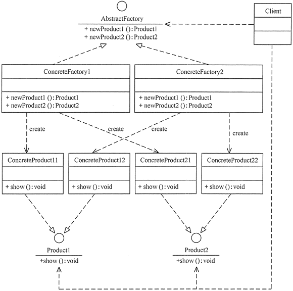

## 抽象工厂方法

工厂方法模式解决了简单工厂模式存在的问题，但由于工厂方法模式中的每个工厂只生产一类产品，可能会导致系统中存在大量的工厂类，势必会增加系统的开销。此时，我们可以考虑将一些相关的产品组成一个“产品族”，由同一个工厂来统一生产，这就是我们本文将要学习的抽象工厂模式的基本思想。

### 模式概述

定义：提供一个创建一系列相关或相互依赖对象的接口，而无须指定它们具体的类。

在抽象工厂模式中，每一个具体工厂都提供了多个工厂方法用于产生多种不同类型的产品，这些产品构成了一个产品族，抽象工厂模式结构如图所示：<br/>


在抽象工厂模式中包含如下几个角色：
* AbstractFactory（抽象工厂）：它声明一组用于创建一族产品的方法，每一个方法对应一种产品。
* ConcreteFactory（具体工厂）：它实现抽象工厂中声明的创建产品的方法，生成一组具体产品，这些产品构成了一个产品族，每一个产品都位于某个产品等级结构中。
* AbstractProduct（抽象产品）：它为每种产品声明接口，在抽象产品中声明了产品所具有的业务方法。
* ConcreteProduct（具体产品）：它定义具体工厂生产的具体产品对象，实现抽象产品接口中声明的业务方法。

### 模式实现

在抽象工厂中声明多个工厂方法，用于创建不同类型的产品，抽象工厂可以是接口，也可以是抽象类或者具体类，其典型代码如下所示：

```java
public abstract class AbstractFactory {
    public abstract Color getColor();
    public abstract Shape getShape();
}
```

具体工厂实现抽象工厂，每一个具体的工厂方法可以返回一个特定的产品对象，而同一个具体工厂所创建的产品对象构成了一个产品族。对于每一个具体工厂类，其典型代码如下所示：

```java
public class BlueCircleFactory extends AbstractFactory {

    @Override
    public Color getColor() {
        return new Blue();
    }

    @Override
    public Shape getShape() {
        return new Circle();
    }
}
```

```java
public class RedRectangleFactory extends AbstractFactory {

    @Override
    public Color getColor() {
        return new Red();
    }

    @Override
    public Shape getShape() {
        return new Rectangle();
    }
}
```

与工厂方法模式一样，抽象工厂模式也可为每一种产品提供一组重载的工厂方法，以不同的方式对产品对象进行创建。

### 方案优化

抽象工厂模式同样可以通过读取配置文件生成对应的产品，不再赘述。

### “开闭原则”的倾斜性

针对概述中的例子，如果有一个新的需求，要在抽象工厂类中添加一个工厂方法getSize()，那么我们就需要修改每个具体工厂类，实现getSize()方法，不符合“开闭原则”。

怎么办？答案是抽象工厂模式无法解决该问题，这也是抽象工厂模式最大的缺点。在抽象工厂模式中，增加新的产品族很方便，但是增加新的产品等级结构很麻烦，抽象工厂模式的这种性质称为“开闭原则”的倾斜性。

“开闭原则”要求系统对扩展开放，对修改封闭，通过扩展达到增强其功能的目的，对于涉及到多个产品族与多个产品等级结构的系统，其功能增强包括两方面：<br/>
(1) 增加产品族：对于增加新的产品族，抽象工厂模式很好地支持了“开闭原则”，只需要增加具体产品并对应增加一个新的具体工厂，对已有代码无须做任何修改。<br/>
(2) 增加新的产品等级结构：对于增加新的产品等级结构，需要修改所有的工厂角色，包括抽象工厂类，在所有的工厂类中都需要增加生产新产品的方法，违背了“开闭原则”。

正因为抽象工厂模式存在“开闭原则”的倾斜性，它以一种倾斜的方式来满足“开闭原则”，为增加新产品族提供方便，但不能为增加新产品结构提供这样的方便，因此要求设计人员在设计之初就能够全面考虑，不会在设计完成之后向系统中增加新的产品等级结构，也不会删除已有的产品等级结构，否则将会导致系统出现较大的修改，为后续维护工作带来诸多麻烦。


### 模式总结

抽象工厂模式是工厂方法模式的进一步延伸，由于它提供了功能更为强大的工厂类并且具备较好的可扩展性，在软件开发中得以广泛应用，尤其是在一些框架和API类库的设计中，例如在Java语言的AWT（抽象窗口工具包）中就使用了抽象工厂模式，它使用抽象工厂模式来实现在不同的操作系统中应用程序呈现与所在操作系统一致的外观界面。抽象工厂模式也是在软件开发中最常用的设计模式之一。

1.主要优点<br/>
(1) 抽象工厂模式隔离了具体类的生成，由于这种隔离，更换一个具体工厂就变得相对容易，所有的具体工厂都实现了抽象工厂中定义的那些公共接口，因此只需改变具体工厂的实例，就可以在某种程度上改变整个软件系统的行为。<br/>
(2) 当一个产品族中的多个对象被设计成一起工作时，它能够保证客户端始终只使用同一个产品族中的对象。<br/>
(3) 增加新的产品族很方便，无须修改已有系统，符合“开闭原则”。

2.主要缺点<br/>
增加新的产品等级结构麻烦，需要对原有系统进行较大的修改，甚至需要修改抽象层代码，违背了“开闭原则”。

3.适用场景<br/>
(1) 用户不关心对象的创建过程，将对象的创建和使用解耦。<br/>
(2) 系统中有多于一个的产品族，而每次只使用其中某一产品族。<br/>
(3) 产品等级结构稳定，不会向系统中增加新的产品等级结构或者删除已有的产品等级结构。

### 思考
抽象工厂模式是否符合“开闭原则”？【从增加新的产品等级结构和增加新的产品族两方面进行思考。】

### 参考链接
[抽象工厂模式-Abstract Factory Pattern](https://gof.quanke.name/%E6%8A%BD%E8%B1%A1%E5%B7%A5%E5%8E%82%E6%A8%A1%E5%BC%8F-Abstract%20%20Factory%20Pattern.html)