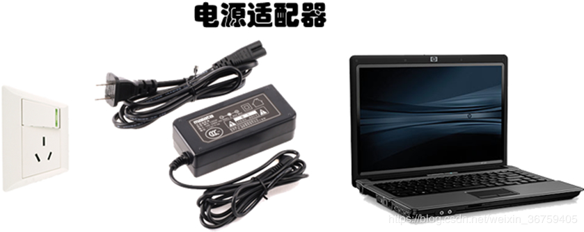
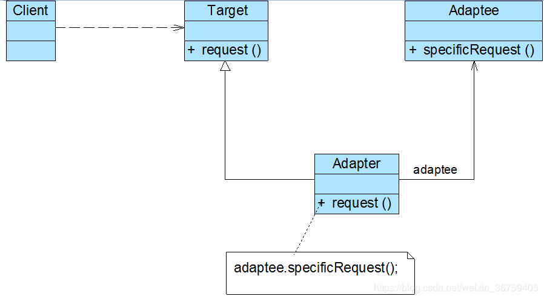

## 适配器模式

笔记本电脑的工作电压一般是20V，而我国的家庭用电是220V，如何让20V的笔记本电脑能够在220V的电压下工作？答案是引入一个电源适配器(AC Adapter)，俗称充电器或变压器。这个电源适配器使生活用电和笔记本电脑得以兼容，如图所示：<br/>


### 模式概述

定义：将一个接口转换成客户希望的另一个接口，使接口不兼容的那些类可以一起工作。

与电源适配器相似，在适配器模式中引入了一个被称为适配器(Adapter)的包装类，而它所包装的对象称为适配者(Adaptee)，即被适配的类。适配器的实现就是把客户类的请求转化为对适配者的相应接口的调用。也就是说：当客户类调用适配器的方法时，在适配器类的内部将调用适配者类的方法，而这个过程对客户类是透明的，客户类并不直接访问适配者类。因此，适配器让那些由于接口不兼容而不能交互的类可以一起工作。

在适配器模式中，我们通过增加一个新的适配器类来解决接口不兼容的问题，使得原本没有任何关系的类可以协同工作。根据适配器类与适配者类的关系不同，适配器模式可分为对象适配器和类适配器两种，在对象适配器模式中，适配器与适配者之间是关联关系；在类适配器模式中，适配器与适配者之间是继承（或实现）关系。在实际开发中，对象适配器的使用频率更高，对象适配器模式结构如图所示：<br/>


在对象适配器模式结构图中包含如下几个角色：
* Target（目标抽象类）：目标抽象类定义客户所需接口，可以是一个抽象类或接口，也可以是具体类。
* Adapter（适配器类）：适配器可以调用另一个接口，作为一个转换器，对Adaptee和Target进行适配，适配器类是适配器模式的核心，在对象适配器中，它通过继承Target并关联一个Adaptee对象使二者产生联系。
* Adaptee（适配者类）：适配者即被适配的角色，它定义了一个已经存在的接口，这个接口需要适配，适配者类一般是一个具体类，包含了客户希望使用的业务方法，在某些情况下可能没有适配者类的源代码。

### 模式实现

目标抽象类典型代码如下所示：

```java
public interface Target {
    void play();
}
```

实际情况中，客户端需要调用play()方法，而适配者类没有该方法，但是它所提供playMusic()方法却是客户端所需要的，适配者类典型代码如下所示：

```
public abstract class Adaptee {

    public abstract void playMusic();
}
```

```java
public class Mp4Adaptee extends Adaptee {

    @Override
    public void playMusic() {
        System.out.println("play mp4");
    }
}
```

```java
public class VlcAdaptee extends Adaptee {

    @Override
    public void playMusic() {
        System.out.println("play vlc");
    }
}
```

为使客户端能够使用适配者类，需要提供一个包装类Adapter，即适配器类，这个包装类包装一个适配者的实例，从而将客户端与适配者衔接起来，在适配器的play()方法中调用适配者的playMp4()方法，典型的适配器类代码如下所示：

```java
public class Adapter implements Target {

    private Adaptee adaptee;

    public Adapter(Adaptee adaptee) {
        this.adaptee = adaptee;
    }

    @Override
    public void play() {
        adaptee.playMusic();
    }
}
```

客户端典型的适配器类代码如下所示：

```java
public class Client {

    public static void main(String[] args) {
        Adaptee adaptee = new Mp4Adaptee();
        Adapter adapter = new Adapter(adaptee);
        adapter.play();
    }
}
```

除对象适配器模式之外，适配器模式还有一种形式，那就是类适配器模式，类适配器模式和对象适配器模式最大的区别在于适配器和适配者之间的关系不同，对象适配器模式中适配器和适配者之间是关联关系，而类适配器模式中适配器和适配者是继承关系。

类适配器模式下，适配器类一版需要实现抽象目标类接口Target，并继承了适配者类，在适配器类的request()方法中调用所继承的适配者类的specificRequest()方法，从而实现适配。

类适配模器模式适配器类典型代码如下所示：

```java
public class Adapter extends Mp4Adaptee implements Target {

    @Override
    public void play() {
        playMusic();
    }
}
```

另外，还有双向适配器模式，实际开发中很少使用，这里就不再介绍。

### 方案改进

很明显，当我们需要更改适配者时，需要修改客户端的代码，不符合“开闭原则”。

我们可以将具体的适配者类信息存储在XML或properties格式的配置文件中，如下config.xml所示：

```xml
<?xml version="1.0"?>
<config>
    <adapteeType>VlcAdaptee</adapteeType>
</config>
```

在通过一个工具类XMLUtil来读取配置文件中的字符串参数，XMLUtil类的代码如下所示：

```java
public class XMLUtil {

    public static Object getAdaptee() {
        try {
            DocumentBuilderFactory dFactory = DocumentBuilderFactory.newInstance();
            DocumentBuilder builder = dFactory.newDocumentBuilder();

            Document doc;
            doc = builder.parse(new File("config.xml"));

            NodeList nl = doc.getElementsByTagName("adapteeType");
            Node classNode = nl.item(0).getFirstChild();

            String className = classNode.getNodeValue();
            Class clazz = Class.forName(className);
            return clazz.newInstance();
        } catch (Exception e) {
            e.printStackTrace();
        }

        return null;
    }
}
```

客户端代码修改如下：

```java
public class Client {

    public static void main(String[] args) {
        Adaptee adaptee = (Adaptee) XMLUtil.getAdaptee();
        adaptee.playMusic();
    }
}
```

[缺省适配器模式](https://gof.quanke.name/%E4%B8%8D%E5%85%BC%E5%AE%B9%E7%BB%93%E6%9E%84%E7%9A%84%E5%8D%8F%E8%B0%83%E2%80%94%E2%80%94%E9%80%82%E9%85%8D%E5%99%A8%E6%A8%A1%E5%BC%8F%EF%BC%88%E5%9B%9B%EF%BC%89.html)

### 模式总结

适配器模式将现有接口转化为客户类所期望的接口，实现对现有类的复用。

1.主要优点<br/>
(1) 将目标类和适配者类解耦，通过引入一个适配器类来重用现有的适配者类，无须修改原有结构。<br/>
(2) 通过使用配置文件，可以很方便地更换适配器，也可以在不修改原有代码的基础上增加新的适配器类，完全符合“开闭原则”。

类适配器模式由于适配器类是适配者类的子类，因此可以在适配器类中置换一些适配者的方法，使得适配器的灵活性更强。

对象适配器模式一个对象适配器可以把适配多个不同的适配者。

2.主要缺点<br/>
类适配器模式对于Java、C#等不支持多继承的语言，一次最多只能适配一个适配者类，同时目标抽象类只能为接口，不能为类，其使用有一定的局限性。

对象适配器模式要在适配器中置换适配者类的某些方法比较麻烦。具体方式可以先做一个适配者类的子类，将适配者类的方法置换掉，然后再把适配者类的子类当做真正的适配者进行适配。

3.适用场景<br/>
(1) 系统需要使用一些现有的类，而这些类的接口（如方法名）不符合系统的需要，甚至没有这些类的源代码。<br/>
(2) 想创建一个可以重复使用的类，用于与一些彼此之间没有太大关联的一些类，包括一些可能在将来引进的类一起工作。

### 思考

在对象适配器中，一个适配器能否适配多个适配者？如果能，应该如何实现？如果不能，请说明原因？

概述中已给出。

在类适配器中，一个适配器能否适配多个适配者？如果能，应该如何实现？如果不能，请说明原因？

不能。

### 参考链接
[适配器模式-Adapter Pattern](https://gof.quanke.name/%E9%80%82%E9%85%8D%E5%99%A8%E6%A8%A1%E5%BC%8F-Adapter%20Pattern.html)
