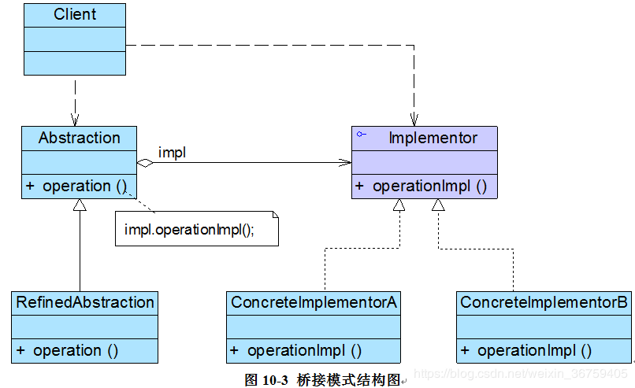

## 桥接模式

### 模式概述

定义：将抽象部分与它的实现部分分离，使它们都可以独立地变化。

如果软件系统中某个类存在两个独立变化的维度，通过该模式可以将这两个维度分离出来，使两者可以独立扩展，让系统更加符合“单一职责原则”。与多层继承方案不同，它将两个独立变化的维度设计为两个独立的继承等级结构，并且在抽象层建立一个抽象关联。

桥接模式用一种巧妙的方式处理多层继承存在的问题，用抽象关联取代传统的多层继承，将类之间的静态继承关系转换为动态的对象组合关系，使得系统更加灵活，并易于扩展，同时有效控制了系统中类的个数。桥接模式结构如图所示：<br/>


在桥接模式结构图中包含如下几个角色：
* Abstraction（抽象类）：用于定义抽象类的接口，它一般是抽象类而不是接口，其中定义一个Implementor（实现类接口）类型的对象，它既可以包含抽象业务方法，也可以包含具体业务方法。
* RefinedAbstraction（扩充抽象类）：扩充由Abstraction定义的接口，通常情况下它不再是抽象类而是具体类，它实现在Abstraction中声明的抽象业务方法，在RefinedAbstraction中可以调用在Implementor中定义的业务方法。
* Implementor（实现类接口）：定义实现类的接口，仅提供基本操作。Implementor接口声明一些基本操作，具体实现交给其子类。通过关联关系，在Abstraction中不仅拥有自己的方法，还可以调用到Implementor中定义的方法，使用关联关系来替代继承关系。
* ConcreteImplementor（具体实现类）：具体实现Implementor接口，在不同的ConcreteImplementor中提供基本操作的不同实现，在程序运行时，ConcreteImplementor对象将替换其父类对象，提供给抽象类具体的业务操作方法。

### 模式实现

在使用桥接模式时，我们首先应该识别出一个类所具有的两个独立变化的维度，将它们设计为两个独立的继承等级结构，为两个维度都提供抽象层，并建立抽象耦合。通常情况下，我们将具有两个独立变化维度的类的一些普通业务方法和与之关系最密切的维度设计为“抽象类”层次结构（抽象部分），而将另一个维度设计为“实现类”层次结构（实现部分）。例如：对于Shape而言，由于形状是其固有的维度，因此可以设计一个抽象的Shape类，在该类中声明并部分实现业务方法，而将各种形状作为其子类，如Circle，Rectangle等；颜色是Shape的另一个维度，由于它与Shape之间存在一种“设置”的关系，因此我们可以提供一个抽象的颜色接口，而将具体的颜色作为实现该接口的子类。

首先需要针对两个不同的维度提取抽象类和实现类接口，并建立一个抽象关联关系。对于“实现部分”，典型的实现类接口代码如下所示：
```java
public interface ColorAPI {
    void drawColor();
}
```

在子类中实现该接口类中声明的方法，其典型代码如下所示：
```java
public class Red implements ColorAPI {

    @Override
    public void drawColor() {
        System.out.println("tint red.");
    }
}

```

对于“抽象部分”，典型的抽象类代码如下所示：
```java
public abstract class Shape {

    protected ColorAPI colorAPI;

    public Shape(ColorAPI colorAPI) {
        this.colorAPI = colorAPI;
    }

    public abstract void draw();
}
```

抽象部分的子类一般称为扩充抽象类，其典型代码如下所示：
```java
public class Circle extends Shape {

    public Circle(ColorAPI colorAPI) {
        super(colorAPI);
    }

    @Override
    public void draw() {
        System.out.print("draw circle, ");
        colorAPI.drawColor();
    }
}
```

客户端代码如下所示：
```java
public class Client {

    public static void main(String[] args) {
        Shape shape = new Circle(new Red());
        shape.draw();
    }
}
```

如果需要新增Shape的种类，只需新增一个扩充抽象类即可，代码如下：
```java
public class Rectangle extends Shape {

    public Rectangle(ColorAPI colorAPI) {
        super(colorAPI);
    }

    @Override
    public void draw() {
        System.out.print("draw rectangle, ");
        colorAPI.drawColor();
    }
}
```

如果需要新增一种颜色，也只需新增一个子类实现接口及接口中声明的方法，代码如下：
```java
public class Green implements ColorAPI {

    @Override
    public void drawColor() {
        System.out.println("tint green.");
    }
}
```

### 方案改进

通过读取配置文件中的信息实例化具体的对象，如下config.xml所示：
```xml
<?xml version="1.0"?>
<config>
    <shape>Circle</shape>
    <color>Green</color>
</config>
```
在通过一个工具类XMLUtil来读取配置文件中的字符串参数，XMLUtil类的代码如下所示：
```java
public class XMLUtil {

    public static Class getClass(String tagName) {
        try {
            DocumentBuilderFactory dFactory = DocumentBuilderFactory.newInstance();
            DocumentBuilder builder = dFactory.newDocumentBuilder();

            Document doc;
            doc = builder.parse(new File("config.xml"));

            NodeList nl = doc.getElementsByTagName(tagName);
            Node node = nl.item(0).getFirstChild();

            String name = node.getNodeValue();
            Class clazz = Class.forName(name);
            //Object obj = clazz.newInstance();
            return clazz;
        } catch (Exception e) {
            e.printStackTrace();
        }

        return null;
    }
}
```

客户端修改如下：
```java
public class Client {

    public static void main(String[] args) throws Exception {
        Class clazz = XMLUtil.getClass("shape");
        Constructor constructor = clazz.getConstructor(ColorAPI.class);

        Shape shape = (Shape) constructor.newInstance((ColorAPI) XMLUtil.getClass("color").newInstance());
        shape.draw();
    }
}
```

### 模式总结

桥接模式是设计Java虚拟机和实现JDBC等驱动程序的核心模式之一，应用较为广泛。在软件开发中如果一个类或一个系统有多个变化维度时，都可以尝试使用桥接模式对其进行设计。

1. 主要优点<br/>
(1) 分离抽象接口及其实现部分。<br/>
(2) 在很多情况下，桥接模式可以取代多层继承方案，多层继承方案违背了“单一职责原则”，复用性较差，且类的个数非常多，桥接模式是比多层继承方案更好的解决方法，它极大减少了子类的个数。<br/>
(3) 在两个变化维度中任意扩展一个维度，都不需要修改原有系统，符合“开闭原则”。

2. 主要缺点<br/>
(1) 桥接模式的使用会增加系统的理解与设计难度，由于关联关系建立在抽象层，要求开发者一开始就针对抽象层进行设计与编程。<br/>
(2) 桥接模式要求正确识别出系统中两个独立变化的维度，因此其使用范围具有一定的局限性。

3. 适用场景<br/>
(1) 如果一个系统需要在抽象化和具体化之间增加更多的灵活性，避免在两个层次之间建立静态的继承关系，通过桥接模式可以使它们在抽象层建立一个关联关系。<br/>
(2) 一个类存在两个（或多个）独立变化的维度，且这两个（或多个）维度都需要独立进行扩展。<br/>
(3) 对于不希望使用继承或因为多层继承导致系统类的个数急剧增加的系统。


### 思考

如果系统中存在两个以上的变化维度，是否可以使用桥接模式进行处理？如果可以，系统该如何设计？

### 参考链接
[桥接模式-Bridge Pattern](https://gof.quanke.name/%E6%A1%A5%E6%8E%A5%E6%A8%A1%E5%BC%8F-Bridge%20Pattern.html)