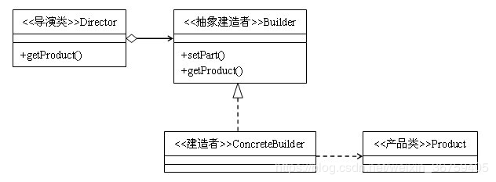

## 建造者模式

### 模式概述

定义：将一个复杂对象的构建与它的表示分离，使得同样的构建过程可以创建不同的表示。

建造者模式是较为复杂的创建型模式，它将客户端与包含多个组成部分（或部件）的复杂对象的创建过程分离，客户端无须知道复杂对象的内部组成部分与装配方式，只需要知道所需建造者的类型即可。它关注如何一步一步创建一个的复杂对象，不同的具体建造者定义了不同的创建过程，且具体建造者相互独立，增加新的建造者非常方便，无须修改已有代码，系统具有较好的扩展性。

建造者模式结构如图所示：<br/>


在建造者模式结构图中包含如下几个角色：
* Builder（抽象建造者）：它为创建一个产品Product对象的各个部件指定抽象接口，在该接口中一般声明两类方法，一类方法是buildX()，用于创建复杂对象的各个部件；另一类方法是getResult()，用于返回复杂对象。Builder既可以是抽象类，也可以是接口。
* ConcreteBuilder（具体建造者）：实现Builder接口，负责各个部件的具体构造和装配方法。
* Product（产品角色）：它是被构建的复杂对象，包含多个组成部件，具体建造者创建该产品的内部表示并定义它的装配过程。
* Director（指挥者）：指挥者又称为导演类，它负责安排复杂对象的建造次序，指挥者与抽象建造者之间存在关联关系，可以在其construct()建造方法中调用建造者对象的部件构造与装配方法，完成复杂对象的建造。客户端一般只需要与指挥者进行交互，在客户端确定具体建造者的类型，并实例化具体建造者对象（也可以通过配置文件和反射机制），然后通过指挥者类的构造函数或者Setter方法将该对象传入指挥者类中。

### 模式实现

在建造者模式的定义中提到了复杂对象，那么什么是复杂对象？简单来说，复杂对象是指那些包含多个成员属性的对象，这些成员属性也称为部件或零件。以点餐为例，食物包含汉堡、饮料以及它们的包装等。

定义一个表示食物条目和食物包装的接口。

```java
public interface Item {
    String name();

    Packing packing();

    float price();
}
```

```java
public interface Packing {
    String pack();
}
```

实现食物包装接口的实体类略。

创建实现Item接口的抽象类，该类提供默认的功能，包括汉堡和饮料。

```java
public abstract class Burger implements Item {

    @Override
    public Packing packing() {
        return new Wrapper();
    }

    @Override
    public abstract float price();
}
```

```java
public abstract class ColdDrink implements Item {

    @Override
    public Packing packing() {
        return new Bottle();
    }

    @Override
    public abstract float price();
}
```

创建扩展Burger和ColdDrink的实体类。

```java
public class ChickenBurger extends Burger {

    @Override
    public float price() {
        return 50.0f;
    }

    @Override
    public String name() {
        return "Chicken Burger";
    }
}
```

```java
public class VegBurger extends Burger {

    @Override
    public float price() {
        return 25.0f;
    }

    @Override
    public String name() {
        return "Veg Burger";
    }
}
```

```java
public class Coke extends ColdDrink {

    @Override
    public float price() {
        return 30.0f;
    }

    @Override
    public String name() {
        return "Coke";
    }
}
```

```java
public class Pepsi extends ColdDrink {

    @Override
    public float price() {
        return 35.0f;
    }

    @Override
    public String name() {
        return "Pepsi";
    }
}
```

创建一个Meal类，包含具体的Item信息。

```java
public class Meal {

    private List<Item> items = new ArrayList<>();

    public void addItem(Item item) {
        items.add(item);
    }

    public float getCost() {
        float cost = 0.0f;
        for (Item item : items) {
            cost += item.price();
        }
        return cost;
    }

    public void showItems() {
        for (Item item : items) {
            System.out.print("Item : " + item.name());
            System.out.print(", Packing : " + item.packing().pack());
            System.out.println(", Price : " + item.price());
        }
    }
}
```

定义抽象建造者，包含创建汉堡和饮料的两个抽象方法和返回具体Meal的抽象方法。

```java
public abstract class AbstractBuilder {

    public abstract void prepareBurger();

    public abstract void prepareDrink();

    public abstract Meal prepareMeal();
}
```

创建具体建造者，实现抽象建造者。

```java
public class MealBuilder extends AbstractBuilder {

    private Meal meal = new Meal();
    
    @Override
    public void prepareBurger() {
        meal.addItem(new VegBurger());
    }

    @Override
    public void prepareDrink() {
        meal.addItem(new Coke());
    }

    @Override
    public Meal prepareMeal() {
        return meal;
    }
}
```

创建指挥者类，在指挥者类中定义setBuilder()方法，在该方法内部实现点餐的逐步构建，典型代码如下：

```java
public class MealDirector {

    public void setBuilder(AbstractBuilder builder) {
        builder.prepareBurger();
        builder.prepareDrink();
    }
}
```

客户端与指挥者类交互。

```java
public class Client {

    public static void main(String[] args) {
        MealDirector director = new MealDirector();
        MealBuilder builder = new MealBuilder();

        director.setBuilder(builder);
        Meal meal = builder.prepareMeal();
        meal.showItems();
        System.out.println("Total Cost: " + meal.getCost());
    }
}
```

### 模式优化

省略Director。在有些情况下，为了简化系统结构，可以将Director和抽象建造者Builder进行合并，在Builder中提供逐步构建复杂产品对象的construct()方法。

```java
public abstract class AbstractBuilder {

    public static Meal noDirectorMeal = new Meal();

    public abstract void noDirectorPrepareBurger();

    public abstract void noDirectorPrepareDrink();

    public static Meal prepareMeal(AbstractBuilder builder) {
        builder.noDirectorPrepareBurger();
        builder.noDirectorPrepareDrink();
        return noDirectorMeal;
    }
}
```

```java
public class MealBuilder extends AbstractBuilder {
    @Override
    public void noDirectorPrepareBurger() {
        noDirectorMeal.addItem(new VegBurger());
    }

    @Override
    public void noDirectorPrepareDrink() {
        noDirectorMeal.addItem(new Coke());
    }
}
```

### 模式总结

建造者模式的核心在于如何一步步构建一个包含多个组成部件的完整对象，使用相同的构建过程构建不同的产品。

1.主要优点<br/>
(1) 在建造者模式中，将产品本身与产品的创建过程解耦，使得相同的创建过程可以创建不同的产品对象。<br/>
(2) 每一个具体建造者都相对独立，可以很方便地替换具体建造者或增加新的具体建造者。由于指挥者类针对抽象建造者编程，增加新的具体建造者无须修改原有类库的代码，系统扩展方便，符合“开闭原则”。

2.主要缺点<br/>
(1) 建造者模式所创建的产品一般具有较多的共同点，如果产品之间的差异性很大，例如很多组成部分都不相同，不适合使用建造者模式，因此其使用范围受到一定的限制。<br/>
(2) 如果产品的内部变化复杂，可能会导致需要定义很多具体建造者类来实现这种变化，导致系统变得很庞大。

3.适用场景<br/>
(1) 需要生成的产品对象有复杂的内部结构。<br/>
(2) 需要生成的产品对象的属性相互依赖，需要指定其生成顺序。<br/>
(3) 隔离复杂对象的创建和使用，并使得相同的创建过程可以创建不同的产品。

### 思考

如果没有指挥者类Director，客户端将如何构建复杂产品？

省略Director的方式。

### 参考链接
[建造者模式-Builder Pattern](https://gof.quanke.name/%E5%BB%BA%E9%80%A0%E8%80%85%E6%A8%A1%E5%BC%8F-Builder%20Pattern.html)