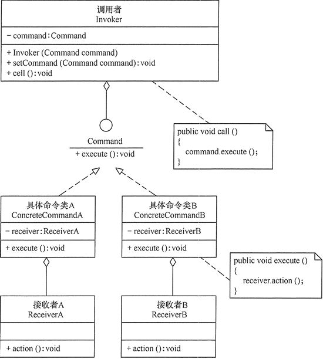

设计模式之命令模式

参考链接：[命令模式-Command Pattern](https://gof.quanke.name/%E5%91%BD%E4%BB%A4%E6%A8%A1%E5%BC%8F-Command%20Pattern.html)

在软件开发中，我们经常需要向某些对象发送请求（调用其中的某个或某些方法），但是并不知道请求的接收者是谁，也不知道被请求的操作是哪个，此时，我们特别希望能够以一种松耦合的方式来设计软件，使得请求发送者与请求接收者能够消除彼此之间的耦合，让对象之间的调用关系更加灵活，可以灵活地指定请求接收者以及被请求的操作。命令模式为此类问题提供了一个较为完美的解决方案。
命令模式可以将请求发送者和接收者完全解耦，发送者与接收者之间没有直接引用关系，发送请求的对象只需要知道如何发送请求，而不必知道如何完成请求。

**1. 模式概述**

定义：将一个请求封装为一个对象，从而让我们可用不同的请求对客户进行参数化；对请求排队或者记录请求日志，以及支持可撤销的操作。

命令模式的核心在于引入了命令类，通过命令类来降低发送者和接收者的耦合度，请求发送者只需指定一个命令对象，再通过命令对象来调用请求接收者的处理方法，其结构如图所示：


* Command（抽象命令类）：抽象命令类一般是一个抽象类或接口，在其中声明了用于执行请求的execute()等方法，通过这些方法可以调用请求接收者的相关操作。
* ConcreteCommand（具体命令类）：具体命令类是抽象命令类的子类，实现在抽象命令类中声明的方法，它对应具体的接收者对象，将接收者对象的动作绑定其中。在实现execute()方法时，将调用接收者对象的相关操作(Action)。
* Invoker（调用者）：调用者即请求发送者，它通过命令对象来执行请求。一个调用者并不需要在设计时确定其接收者，因此它只与抽象命令类之间存在关联关系。在程序运行时可以将一个具体命令对象注入其中，再调用具体命令对象的execute()方法，从而实现间接调用请求接收者的相关操作。
* Receiver（接收者）：接收者执行与请求相关的操作，它具体实现对请求的业务处理。

**2. 模式实现**

命令模式的本质是对请求进行封装，一个请求对应于一个命令，将发出命令的责任和执行命令的责任分割开。每一个命令都是一个操作：请求的一方发出请求要求执行一个操作；接收的一方收到请求，并执行相应的操作。命令模式允许请求的一方和接收的一方独立开来，使得请求的一方不必知道接收请求的一方的接口，更不必知道请求如何被接收、操作是否被执行、何时被执行，以及是怎么被执行的。

命令模式的关键在于引入了抽象命令类，请求发送者针对抽象命令类编程，只有实现了抽象命令类的具体命令才与请求接收者相关联。在最简单的抽象命令类中只包含了一个抽象的execute()方法，每个具体命令类将一个Receiver类型的对象作为一个实例变量进行存储，从而具体指定一个请求的接收者，不同的具体命令类提供了execute()方法的不同实现，并调用不同接收者的请求处理方法。典型的抽象命令类代码如下所示：

```java
public abstract class AbstractCommand {
    public abstract void execute();
}
```

对于请求发送者即调用者而言，将针对抽象命令类进行编程，可以通过构造注入或者设值注入的方式在运行时传入具体命令类对象，并在业务方法中调用命令对象的execute()方法，其典型代码如下所示：

```java
public class Invoker {

    private AbstractCommand command;

    /**
     * 构造注入
     *
     * @param command 抽象命令类
     */
    public Invoker(AbstractCommand command) {
        this.command = command;
    }

    /**
     * 设值注入
     *
     * @param command 抽象命令类
     */
    public void setCommand(AbstractCommand command) {
        this.command = command;
    }

    public void call() {
        command.execute();
    }
}
```

具体命令类继承了抽象命令类，它与请求接收者相关联，实现了在抽象命令类中声明的execute()方法，并在实现时调用接收者的请求响应方法action()，其典型代码如下所示：

```java
public class ConcreteCommand extends AbstractCommand {

    // 维持一个对请求接收者对象的引用
    private AbstractReceiver receiver;

    public void setReceiver(AbstractReceiver receiver) {
        this.receiver = receiver;
    }

    @Override
    public void execute() {
        receiver.act();
    }
}
```

请求接收者Receiver类具体实现对请求的业务处理，它提供了act()方法，用于执行与请求相关的操作，其典型代码如下所示：

```java
public abstract class AbstractReceiver {

    public abstract void act();
}

public class ConcreteReceiver extends AbstractReceiver {

    @Override
    public void act() {
        // 具体操作
        System.out.println("Receiver get the command.");
    }
}
```

具体调用代码如下：

```java
public class Client {

    public static void main(String[] args) {
        ConcreteCommand command = new ConcreteCommand();
        command.setReceiver(new ConcreteReceiverA());
        Invoker invoker = new Invoker(command);
        invoker.call();
    }
}
```

**3. 命令队列**

有时候我们需要将多个请求排队，当一个请求发送者发送一个请求时，将不止一个请求接收者产生响应，这些请求接收者将逐个执行业务方法，完成对请求的处理。此时，我们可以通过命令队列来实现。

命令队列的实现方法有多种形式，其中最常用、灵活性最好的一种方式是增加一个CommandQueue类，由该类来负责存储多个命令对象，而不同的命令对象可以对应不同的请求接收者，CommandQueue类的典型代码如下所示：

```java
public class CommandQueue {

    private ArrayList<AbstractCommand> commands = new ArrayList<>();

    public void addCommand(AbstractCommand command) {
        commands.add(command);
    }

    public void removeCommand(AbstractCommand command) {
        commands.remove(command);
    }

    public void execute() {
        // 循环调用每一个命令对象的execute()方法
        for (Object command : commands) {
            ((AbstractCommand) command).execute();
        }
    }
}
```

在增加命令队列类CommandQueue以后，请求发送者类Invoker将针对CommandQueue编程，代码修改如下：

```java
public class Invoker {

    private AbstractCommand command;

    private CommandQueue commandQueue;

    /**
     * 构造注入
     *
     * @param command 抽象命令类
     */
    public Invoker(AbstractCommand command) {
        this.command = command;
    }

    /**
     * 构造注入
     *
     * @param commandQueue 抽象命令队列类
     */
    public Invoker(CommandQueue commandQueue) {
        this.commandQueue = commandQueue;
    }

    /**
     * 设值注入
     *
     * @param command 抽象命令类
     */
    public void setCommand(AbstractCommand command) {
        this.command = command;
    }

    /**
     * 构造注入
     *
     * @param commandQueue 抽象命令队列类
     */
    public void setCommandQueue(CommandQueue commandQueue) {
        this.commandQueue = commandQueue;
    }

    public void call() {
        command.execute();
    }
    
    public void queueCall() {
        commandQueue.execute();
    }
}
```

具体调用代码如下：

```java
public class Client {

    public static void main(String[] args) {
        CommandQueue commandQueue = new CommandQueue();
        commandQueue.addCommand(command);
        commandQueue.addCommand(command);
        invoker.setCommandQueue(commandQueue);
        invoker.queueCall();
    }
}
```

命令队列与我们常说的“批处理”有点类似。批处理，顾名思义，可以对一组对象（命令）进行批量处理，当一个发送者发送请求后，将有一系列接收者对请求作出响应，命令队列可以用于设计批处理应用程序，如果请求接收者的接收次序没有严格的先后次序，我们还可以使用多线程技术来并发调用命令对象的execute()方法，从而提高程序的执行效率。

**4. 我的思考**

一个请求发送者能否对应多个请求接收者？如何实现？

可以参照命令队列的形式定义请求者队列，代码如下：

```java
public class ReceiverQueue {

    private ArrayList<AbstractReceiver> receivers = new ArrayList<>();

    public ArrayList<AbstractReceiver> getReceivers() {
        return receivers;
    }

    public void addReceiver(AbstractReceiver receiver) {
        receivers.add(receiver);
    }

    public void removeReceiver(AbstractReceiver receiver) {
        receivers.remove(receiver);
    }
}
```

在抽象命令类中定义一个抽象的queueExecute()方法，用以区分发给请求队列的执行方法。

```java
public abstract class AbstractCommand {

    public abstract void execute();

    public abstract void queueExecute();
}
```

具体命令类可以修改成以下：

```java
public class ConcreteCommand extends AbstractCommand {

    // 维持一个对请求接收者对象的引用
    private AbstractReceiver receiver;

    // 维持一个对请求接收者对象队列的引用
    private ReceiverQueue receiverQueue;

    public void setReceiver(AbstractReceiver receiver) {
        this.receiver = receiver;
    }

    public void setReceiverQueue(ReceiverQueue receiverQueue) {
        this.receiverQueue = receiverQueue;
    }

    @Override
    public void execute() {
        receiver.act();
    }

    @Override
    public void queueExecute() {
        ArrayList<AbstractReceiver> receivers = receiverQueue.getReceivers();
        for (AbstractReceiver receiver : receivers) {
            receiver.act();
        }
    }
}
```

具体调用代码如下：

```java
public class Client {

    public static void main(String[] args) {
        ReceiverQueue receiverQueue = new ReceiverQueue();
        receiverQueue.addReceiver(new ConcreteReceiverA());
        receiverQueue.addReceiver(new ConcreteReceiverB());
        command.setReceiverQueue(receiverQueue);
        invoker = new Invoker(command);
        invoker.callAll();
    }
}
```

**5. 模式总结**

命令模式是一种使用频率非常高的设计模式，它可以将请求发送者与接收者解耦，请求发送者通过命令对象来间接引用请求接收者，使得系统具有更好的灵活性和可扩展性。

1. 主要优点 <br/>
(1) 降低系统的耦合度。由于请求者与接收者之间不存在直接引用，因此请求者与接收者之间实现完全解耦，相同的请求者可以对应不同的接收者，同样，相同的接收者也可以供不同的请求者使用，两者之间具有良好的独立性。<br/>
(2) 新的命令可以很容易地加入到系统中。由于增加新的具体命令类不会影响到其他类，因此增加新的具体命令类很容易，无须修改原有系统源代码，甚至客户类代码，满足“开闭原则”的要求。


2. 主要缺点 <br/>
使用命令模式可能会导致某些系统有过多的具体命令类。因为针对每一个对请求接收者的调用操作都需要设计一个具体命令类，因此在某些系统中可能需要提供大量的具体命令类，这将影响命令模式的使用。

3. 适用场景 <br/>
(1)	系统需要将请求调用者和请求接收者解耦，使得调用者和接收者不直接交互。请求调用者无须知道接收者的存在，也无须知道接收者是谁，接收者也无须关心何时被调用。<br/>
(2)	系统需要在不同的时间指定请求、将请求排队和执行请求。