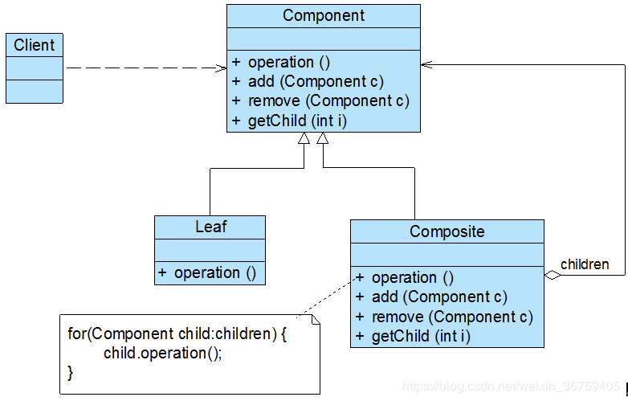

## 组合模式

树形结构在软件中随处可见，例如操作系统中的目录结构、应用软件中的菜单、办公系统中的公司组织结构等等，如何运用面向对象的方式来处理这种树形结构是组合模式需要解决的问题，组合模式通过一种巧妙的设计方案使得用户可以一致性地处理整个树形结构或者树形结构的一部分，也可以一致性地处理树形结构中的叶子节点（不包含子节点的节点）和容器节点（包含子节点的节点）。

### 模式概述

定义：组合多个对象形成树形结构以表示具有“整体—部分”关系的层次结构。

在组合模式中引入了抽象构件类Component，它是所有容器类和叶子类的公共父类，客户端针对Component进行编程。组合模式结构如图所示：<br/>


在组合模式结构图中包含如下几个角色：
* Component（抽象构件）：它可以是接口或抽象类，为叶子构件和容器构件对象声明接口，在该角色中可以包含所有子类共有行为的声明和实现。在抽象构件中定义了访问及管理它的子构件的方法，如增加子构件、删除子构件、获取子构件等。
* Leaf（叶子构件）：它在组合结构中表示叶子节点对象，它实现在抽象构件中定义的行为。对于那些访问及管理子构件的方法，可以通过异常等方式进行处理。
* Composite（容器构件）：它在组合结构中表示容器节点对象，容器节点包含子节点，其子节点可以是叶子节点，也可以是容器节点，它提供一个集合用于存储子节点，实现在抽象构件中定义的行为，包括那些访问及管理子构件的方法，在其业务方法中可以递归调用其子节点的业务方法。

### 模式实现

下面通过简单的示例代码来分析组合模式的各个角色的用途和实现。对于组合模式中的抽象构件角色，其典型代码如下所示：
```java
public abstract class Component {

    private String str;

    public Component(String str) {
        this.str = str;
    }

    /**
     * 添加子节点
     *
     * @param c 添加的节点
     */
    public abstract void add(Component c);

    /**
     * 删除子元素
     *
     * @param c 删除的节点
     */
    public abstract void remove(Component c);

    /**
     * 获取所有子节点
     *
     * @return List<Component>
     */
    public abstract List<Component> getChild();

    /**
     * 获取指定下标的节点
     *
     * @param i 下标
     * @return Component
     */
    public abstract Component getChild(int i);

    public void print() {
        System.out.println(this.str);
    }
}
```

一般将抽象构件类设计为接口或抽象类，将所有子类共有方法的声明和实现放在抽象构件类中。对于客户端而言，将针对抽象构件编程，而无须关心其具体子类是容器构件还是叶子构件。

如果继承抽象构件的是叶子构件，则其典型代码如下所示：
```java
public class Leaf extends Component {

    public Leaf(String str) {
        super(str);
    }

    @Override
    public void add(Component c) {
        System.out.println("叶子节点不支持add方法");
    }

    @Override
    public void remove(Component c) {
        System.out.println("叶子节点不支持remove方法");
    }

    @Override
    public List<Component> getChild() {
        return null;
    }

    @Override
    public Component getChild(int i) {
        return null;
    }
}
```

作为抽象构件类的子类，在叶子构件中需要实现在抽象构件类中声明的所有方法，包括业务方法以及管理和访问子构件的方法，但是叶子构件不能再包含子构件，因此在叶子构件中实现子构件管理和访问方法时需要提供异常处理或错误提示。

如果继承抽象构件的是容器构件，则其典型代码如下所示：
```java
public class Composite extends Component {

    private List<Component> list = new ArrayList<>();

    public Composite(String str) {
        super(str);
    }

    @Override
    public void add(Component c) {
        list.add(c);
    }

    @Override
    public void remove(Component c) {
        list.remove(c);
    }

    @Override
    public Component getChild(int i) {
        return list.get(i);
    }

    @Override
    public List<Component> getChild() {
        return list;
    }
}
```

在容器构件中实现了在抽象构件中声明的所有方法，既包括业务方法，也包括用于访问和管理成员子构件的方法。

客户端典型代码如下：
```java
public class Client {

    public static void main(String[] args) {
        Component root, componentA, componentB, leafA1, leafA2, leafA3, leafB1, leafB2;

        root = new Composite("root");

        componentA = new Composite("componentA");
        componentB = new Composite("componentB");
        root.add(componentA);
        root.add(componentB);

        leafA1 = new Leaf("leafA1");
        leafA2 = new Leaf("leafA2");
        leafA3 = new Leaf("leafA3");
        componentA.add(leafA1);
        componentA.add(leafA2);
        componentA.add(leafA3);

        leafB1 = new Leaf("leafB1");
        leafB2 = new Leaf("leafB2");
        componentB.add(leafB1);
        componentB.add(leafB2);

        componentA.getChild(1);
        componentA.remove(leafA3);

        leafB2.add(leafA1);

        root.print();
        for (Component first : root.getChild()) {
            first.print();
            List<Component> child = first.getChild();
            if (child == null) continue;
            for (Component second : child) {
                second.print();
            }
        }
    }
}
```

### 优化

如果我们只在子节点中存储节点信息，即只打印子节点的内容，那么我们可以优化容器构件，对容器构件进行处理时使用递归算法，即在容器构件的print()方法中递归调用其成员构件的print()方法。

抽象化Component的println()方法，代码如下所示：
```java
/**
 * 打印属性
 */
public abstract void println();
```

容器构件实现该方法，遍历子节点并调用其print()方法，代码如下所示：
```java
@Override
public void println() {
    for (Component c : list) {
        c.println();
    }
}
```

叶子节点实现该方法并调用Component的print()方法，代码如下所示：
```java
@Override
public void println() {
    super.print();
}
```

### 模式总结

组合模式使用面向对象的思想来实现树形结构的构建与处理，描述了如何将容器对象和叶子对象进行递归组合，实现简单，灵活性好。

1.主要优点<br/>
(1) 组合模式可以清楚地定义分层次的复杂对象，表示对象的全部或部分层次，方便对整个层次结构进行控制。<br/>
(2) 客户端可以一致地使用一个组合结构或其中单个对象，不必关心处理的是单个对象还是整个组合结构，简化了客户端代码。<br/>
(3) 在组合模式中增加新的容器构件和叶子构件都很方便，无须对现有类库进行任何修改，符合“开闭原则”。

2.主要缺点<br/>
在增加新构件时很难对容器中的构件类型进行限制。有时候我们希望一个容器中只能有某些特定类型的对象，例如在某个文件夹中只能包含文本文件，使用组合模式时，不能依赖类型系统来施加这些约束，因为它们都来自于相同的抽象层，在这种情况下，必须通过在运行时进行类型检查来实现，这个实现过程较为复杂。

3.适用场景<br/>
(1) 在具有整体和部分的层次结构中，希望通过一种方式忽略整体与部分的差异，客户端可以一致地对待它们。<br/>
(2) 在一个使用面向对象语言开发的系统中需要处理一个树形结构。<br/>
(3) 在一个系统中能够分离出叶子对象和容器对象，而且它们的类型不固定，需要增加一些新的类型。

### 思考

在组合模式结构图中，如果聚合关联关系不是从Composite到Component的，而是从Composite到Leaf的，如图所示，会产生怎样的结果？

### 参考链接
[组合模式-Composite Pattern](https://gof.quanke.name/%E7%BB%84%E5%90%88%E6%A8%A1%E5%BC%8F-Composite%20Pattern.html)