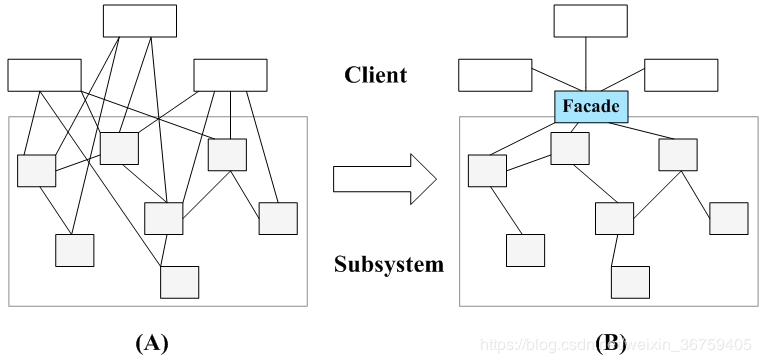

## 外观模式

### 模式概述

定义：定义一个高层接口作为为子系统中一组接口的统一入口。

外观模式通过引入一个新的外观类(Facade)为子系统提供一个统一的入口，简化了类与类之间的交互。下图可以直观的表达外观模式的作用：<br/>


外观模式没有一个一般化的类图描述，下图所示的类图可以作为描述外观模式的结构图。<br/>


外观模式包含如下两个角色：
* Facade（外观角色）：在客户端可以调用它的方法，在外观角色中可以知道相关子系统的功能和责任；在正常情况下，它将所有从客户端发来的请求委派到相应的子系统去，传递给相应的子系统对象处理。
* SubSystem（子系统角色）：在软件系统中可以有一个或者多个子系统角色，每一个子系统可以不是一个单独的类，而是一个类的集合，它实现子系统的功能；每一个子系统都可以被客户端直接调用，或者被外观角色调用，它处理由外观类传过来的请求。

### 模式实现

外观模式的主要目的在于降低系统的复杂程度，在面向对象软件系统中，类与类之间的关系越多，在维护和修改时就越缺乏灵活性，因为一个类的改动会导致多个类发生变化，而外观模式的引入在很大程度上降低了类与类之间的耦合关系。引入外观模式之后，增加新的子系统或者移除子系统都非常方便，客户类无须进行修改（或者极少的修改），只需要在外观类中增加或移除对子系统的引用即可。从这一点来说，外观模式在一定程度上并不符合开闭原则，增加新的子系统需要对原有系统进行一定的修改。

外观模式中所指的子系统是一个广义的概念，它可以是一个类、一个功能模块、系统的一个组成部分或者一个完整的系统。子系统类通常是一些业务类，实现了一些具体的、独立的业务功能，其典型代码如下：

```java
public interface Shape {
    void draw();
}
```

```java
public class Circle implements Shape {

    @Override
    public void draw() {
        System.out.println("Circle::draw()");
    }
}
```

```java
public class Rectangle implements Shape {

    @Override
    public void draw() {
        System.out.println("Rectangle::draw()");
    }
}
```

```java
public class Square implements Shape {

    @Override
    public void draw() {
        System.out.println("Square::draw()");
    }
}
```

在引入外观类之后，与子系统业务类之间的交互统一由外观类来完成，在外观类中通常存在如下代码：
```java
public class ShapeMaker {
    private Shape circle;
    private Shape rectangle;
    private Shape square;

    public ShapeMaker() {
        circle = new Circle();
        rectangle = new Rectangle();
        square = new Square();
    }

    public void drawAll() {
        circle.draw();
        rectangle.draw();
        square.draw();
    }

    public void drawCircle() {
        circle.draw();
    }

    public void drawRectangle() {
        rectangle.draw();
    }

    public void drawSquare() {
        square.draw();
    }
}
```

由于在外观类中有子系统对象的引用，客户端可以通过外观类来间接调用子系统对象的业务方法，而无须与子系统对象直接交互。引入外观类后，客户端代码变得非常简单，典型代码如下：
```java
public class Client {

    public static void main(String[] args) {
        ShapeMaker shapeMaker = new ShapeMaker();

        shapeMaker.drawAll();

        shapeMaker.drawCircle();
        shapeMaker.drawRectangle();
        shapeMaker.drawSquare();
    }
}
```

### 模式总结

外观模式是一种使用频率非常高的设计模式，它通过引入一个外观角色来简化客户端与子系统之间的交互，为复杂的子系统调用提供一个统一的入口，使子系统与客户端的耦合度降低。外观模式并不给系统增加任何新功能，它仅仅是简化调用接口。在几乎所有的软件中都能够找到外观模式的应用，如绝大多数B/S系统都有一个首页或者导航页面，大部分C/S系统都提供了菜单或者工具栏，在这里，首页和导航页面就是B/S系统的外观角色，而菜单和工具栏就是C/S系统的外观角色，通过它们用户可以快速访问子系统，降低了系统的复杂程度。所有涉及到与多个业务对象交互的场景都可以考虑使用外观模式进行重构。

1.主要优点<br/>
(1) 它对客户端屏蔽子系统组件，减少客户端所需处理的对象数目。<br/>
(2) 它实现子系统与客户端之间的松耦合关系。<br/>
(3) 一个子系统的修改对其他子系统没有任何影响，而且子系统内部变化也不会影响到外观对象。

2.主要缺点<br/>
不能很好地限制客户端直接使用子系统类。

3.适用场景<br/>
(1) 当要为访问一系列复杂的子系统提供一个简单入口时可以使用外观模式。<br/>
(2) 客户端程序与多个子系统之间存在很大的依赖性。引入外观类可以将子系统与客户端解耦，从而提高子系统的独立性和可移植性。<br/>
(3) 在层次化结构中，可以使用外观模式定义系统中每一层的入口，层与层之间不直接产生联系，而通过外观类建立联系，降低层之间的耦合度。

### 参考链接
[外观模式-Facade Pattern](https://gof.quanke.name/%E5%A4%96%E8%A7%82%E6%A8%A1%E5%BC%8F-Facade%20Pattern.html)