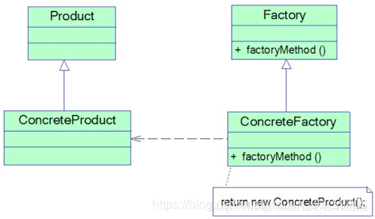

## 工厂方法模式

在介绍[简单工厂模式](https://blog.csdn.net/weixin_36759405/article/details/84329850)时提到简单工厂模式存在一个很严重的问题，就是当系统中需要引入新产品时，由于静态工厂方法通过所传入参数的不同来创建不同的产品，这必定要修改工厂类的源代码，将违背“开闭原则”，如何实现增加新产品而不影响已有代码？工厂方法模式应运而生，本文将介绍第二种工厂模式——工厂方法模式。

### 模式概述

定义一个用于创建对象的接口，让子类决定将哪一个类实例化。工厂方法模式让一个类的实例化延迟到其子类。

工厂方法模式提供一个抽象工厂接口来声明抽象工厂方法，而由其子类来具体实现工厂方法，创建具体的产品对象。工厂方法模式结构如图所示：<br/>


在工厂方法模式结构图中包含如下几个角色：
* 抽象产品类 它是定义产品的接口，是工厂方法模式所创建对象的超类。
* 具体产品类 实现抽象产品接口，某种类型的具体产品由专门的具体工厂创建，具体工厂和具体产品之间一一对应。
* 抽象工厂类 抽象工厂是工厂方法模式的核心，是具体工厂的父类，声明工厂方法。
* 具体工厂类 它是抽象工厂类的子类，实现抽象工厂中定义的工厂方法，并可由客户端调用，返回一个具体产品类的实例。

### 模式实现

与简单工厂模式相比，工厂方法模式最重要的区别是引入了抽象工厂角色，抽象工厂可以是接口，也可以是抽象类或者具体类，其典型代码如下所示：
```
public abstract class AbstractFactory {

    public abstract Shape getShape();
}
```

具体产品对象的创建由其子类负责，客户端针对抽象工厂编程，可在运行时再指定具体工厂类，具体工厂类实现工厂方法，不同的具体工厂可以创建不同的具体产品，其典型代码如下所示：
```java
public class CircleFactory extends AbstractFactory {

    /**
     * 返回具体的 Circle 实例
     *
     * @return
     */
    @Override
    public Shape getShape() {
        return new Circle();
    }
}
```

```java
public class RectangleFactory extends AbstractFactory {

    /**
     * 返回具体的 Rectangle 实例
     *
     * @return
     */
    @Override
    public Shape getShape() {
        return new Rectangle();
    }
}
```

```java
public class SquareFactory extends AbstractFactory {

    /**
     * 返回具体的 Square 实例
     *
     * @return
     */
    @Override
    public Shape getShape() {
        return new Square();
    }
}
```

在实际使用时，具体工厂类在实现工厂方法时除了创建具体产品对象之外，还可以负责产品对象的初始化工作以及一些资源和环境配置工作，例如连接数据库、创建文件等。

在客户端代码中，只需关心工厂类即可，不同的具体工厂可以创建不同的产品，典型的客户端类代码片段如下所示：
```java
public class Client {

    public static void main(String[] args) {
        AbstractFactory factory;
        factory = new CircleFactory();
        Shape circle = factory.getShape();
        circle.draw();
    }
}
```

### 方案改进

可以通过配置文件来存储具体工厂类ConcreteFactory的类名，更换新的具体工厂时无须修改源代码，系统扩展更为方便。

在客户端代码中将不再使用new关键字来创建工厂对象，而是将具体工厂类的类名存储在配置文件（如XML文件）中，通过读取配置文件获取类名字符串，再使用Java的反射机制，根据类名字符串生成对象。

在配置文件config.xml用于存储具体日志记录器工厂类类名：
```xml
<?xml version="1.0"?>
<config>
  <!-- 具体工厂类的全限定名 包名+类名 -->
  <className>RectangleFactory</className>
</config>
```

创建XMLUtil类读取该配置文件并通过存储在其中的类名字符串反射生成对象，其详细代码如下：
```java
public class XMLUtil {

    public static Object getFactory() {
        try {
            DocumentBuilderFactory dFactory = DocumentBuilderFactory.newInstance();
            DocumentBuilder builder = dFactory.newDocumentBuilder();

            Document doc;
            doc = builder.parse(new File("config.xml"));

            NodeList nl = doc.getElementsByTagName("className");
            Node classNode = nl.item(0).getFirstChild();

            String className = classNode.getNodeValue();
            Class clazz = Class.forName(className);
            Object obj = clazz.newInstance();
            return obj;
        } catch (Exception e) {
            e.printStackTrace();
        }

        return null;
    }
}
```

要更换具体工厂时，通过XMLUtil类的静态方法getFactory()方法读取配置文件中的工厂类名进行对象的实例化，代码修改如下：

```java
public class Client {

    public static void main(String[] args) {
        AbstractFactory factory;
        factory = (AbstractFactory) XMLUtil.getFactory();
        Shape shape = factory.getShape();
        shape.draw();
    }
}
```

重载抽象工厂类的工厂方法可以实现多种方式初始化具体产品类，例如提供无参数的默认实现，还可以提供包含一个字符串参数的实现。

```java
public abstract class AbstractFactory {

    public abstract Shape getShape();

    public abstract Shape getShape(String args);

    public abstract Shape getShape(Object obj);
}
```

具体的工厂类实现重载的工厂方法，这些方法可以包含不同的业务逻辑，以满足对不同产品对象的需求。

### 模式总结

工厂方法模式是简单工厂模式的延伸，它继承了简单工厂模式的优点，同时还弥补了简单工厂模式的不足。工厂方法模式是使用频率最高的设计模式之一，是很多开源框架和API类库的核心模式。

1. 主要优点<br/>
(1) 在工厂方法模式中，工厂方法用来创建客户所需要的产品，同时还向客户隐藏了哪种具体产品类将被实例化这一细节，用户只需要关心所需产品对应的工厂，无须关心创建细节。<br/>
(2) 基于工厂角色和产品角色的多态性设计是工厂方法模式的关键。它能够让工厂可以自主确定创建何种产品对象，而如何创建这个对象的细节则完全封装在具体工厂内部。<br/>
(3) 使用工厂方法模式的另一个优点是在系统中加入新产品时，无须修改抽象工厂和抽象产品提供的接口，无须修改客户端，也无须修改其他的具体工厂和具体产品，而只要添加一个具体工厂和具体产品即可，系统的可扩展性也就变得非常好，完全符合“开闭原则”。

2. 主要缺点<br/>
(1) 在添加新产品时，需要编写新的具体产品类，而且还要提供与之对应的具体工厂类，系统中类的个数将成对增加，在一定程度上增加了系统的复杂度。<br/>
(2) 由于考虑到系统的可扩展性，需要引入抽象层，在客户端代码中均使用抽象层进行定义，增加了系统的抽象性和理解难度。

3. 适用场景<br/>
(1) 客户端不知道它所需要的对象的类。在工厂方法模式中，客户端不需要知道具体产品类的类名，只需要知道所对应的工厂即可，具体的产品对象由具体工厂类创建，可将具体工厂类的类名存储在配置文件中。<br/>
(2) 抽象工厂类通过其子类来指定创建哪个对象。在工厂方法模式中，对于抽象工厂类只需要提供一个创建产品的接口，而由其子类来确定具体要创建的对象，利用面向对象的多态性和里氏代换原则，在程序运行时，子类对象将覆盖父类对象，从而使得系统更容易扩展。

### 参考链接
[工厂方法模式-Factory Method Pattern](https://gof.quanke.name/%E5%B7%A5%E5%8E%82%E6%96%B9%E6%B3%95%E6%A8%A1%E5%BC%8F-Factory%20Method%20Pattern.html)
