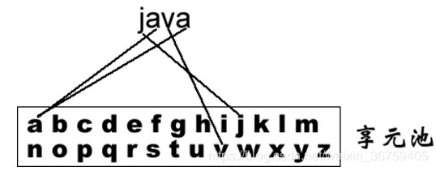
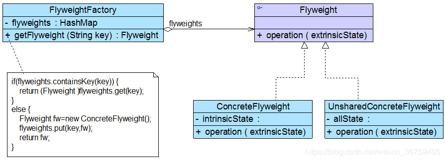

# 享元模式

## 模式概述

定义：运用共享技术有效地支持大量细粒度对象的复用。系统只使用少量的对象，而这些对象都很相似，状态变化很小，可以实现对象的多次复用。

当一个软件系统在运行时产生的对象数量太多，将会导致运行代价过高，带来系统性能下降等问题。例如在一个文本字符串中存在很多重复的字符，如果每一个字符都用一个单独的对象来表示，将会占用较多的内存空间，那么我们如何去避免系统中出现大量相同或相似的对象，同时又不影响客户端程序通过面向对象的方式对这些对象进行操作？享元模式正为解决这一类问题而诞生。享元模式通过共享技术实现相同或相似对象的重用，在逻辑上每一个出现的字符都有一个对象与之对应，然而在物理上它们却共享同一个享元对象，这个对象可以出现在一个字符串的不同地方，相同的字符对象都指向同一个实例，在享元模式中，存储这些共享实例对象的地方称为享元池(Flyweight Pool)。我们可以针对每一个不同的字符创建一个享元对象，将其放在享元池中，需要时再从享元池取出。如图所示：<br/>


享元模式以共享的方式高效地支持大量细粒度对象的重用，享元对象能做到共享的关键是区分了内部状态(Intrinsic State)和外部状态(Extrinsic State)。下面将对享元的内部状态和外部状态进行简单的介绍：
(1) 内部状态是存储在享元对象内部并且不会随环境改变而改变的状态，内部状态可以共享。如字符的内容，不会随外部环境的变化而变化，无论在任何环境下字符“a”始终是“a”，都不会变成“b”。
(2) 外部状态是随环境改变而改变的、不可以共享的状态。享元对象的外部状态通常由客户端保存，并在享元对象被创建之后，需要使用的时候再传入到享元对象内部。一个外部状态与另一个外部状态之间是相互独立的。如字符的颜色，可以在不同的地方有不同的颜色，例如有的“a”是红色的，有的“a”是绿色的。

享元模式结构较为复杂，一般结合工厂模式一起使用，在它的结构图中包含了一个享元工厂类，其结构图如图所示：<br/>


在享元模式结构图中包含如下几个角色：
* Flyweight（抽象享元类）：通常是一个接口或抽象类，在抽象享元类中声明具体享元类公共的方法，这些方法可以向外界提供享元对象的内部数据（内部状态），同时也可以通过这些方法来设置外部数据（外部状态）。
* ConcreteFlyweight（具体享元类）：它实现抽象享元类，在具体享元类中为内部状态提供了存储空间。通常我们可以结合单例模式来设计具体享元类，为每一个具体享元类提供唯一的享元对象。
* UnsharedConcreteFlyweight（非共享具体享元类）：并不是所有的抽象享元类的子类都需要被共享，不能被共享的子类可设计为非共享具体享元类。
* FlyweightFactory（享元工厂类）：享元工厂类用于创建并管理享元对象，它针对抽象享元类编程，将各种类型的具体享元对象存储在一个享元池中，享元池一般设计为一个存储“键值对”的集合（也可以是其他类型的集合），可以结合工厂模式进行设计；当用户请求一个具体享元对象时，享元工厂提供一个存储在享元池中已创建的实例或者创建一个新的实例（如果不存在的话），返回新创建的实例并将其存储在享元池中。

## 模式实现

在享元模式中引入了享元工厂类，享元工厂类的作用在于提供一个用于存储享元对象的享元池，当用户需要对象时，首先从享元池中获取，如果享元池中不存在，则创建一个新的享元对象返回给用户，并在享元池中保存该新增对象。典型的享元工厂类的代码如下：
```java
public class ShapeFactory {

    private static final HashMap<String, Shape> circleMap = new HashMap<>();

    public static Shape getCircle(String color) {
        Circle circle = (Circle) circleMap.get(color);

        if (circle == null) {
            circle = new Circle(color);
            circleMap.put(color, circle);
            System.out.println("Creating circle of color : " + color);
        }
        return circle;
    }
}
```

享元类的设计是享元模式的要点之一，在享元类中要将内部状态和外部状态分开处理，通常将内部状态作为享元类的成员变量，而外部状态通过注入的方式添加到享元类中（示例代码中将内部、外部状态都设置成成员变量，但只有外部状态可以通过set方法注入）。典型的抽象和具体享元类代码分别如下所示：
```java
public interface Shape {
    void draw();
}
```

```java
public class Circle implements Shape {

    private String color;
    private int x;
    private int y;
    private int radius;

    public Circle(String color) {
        this.color = color;
    }

    public void setX(int x) {
        this.x = x;
    }

    public void setY(int y) {
        this.y = y;
    }

    public void setRadius(int radius) {
        this.radius = radius;
    }

    @Override
    public void draw() {
        System.out.println("Circle: Draw() [Color: " + color
                + ", x: " + x + ", y:" + y + ", radius:" + radius);
    }
}
```

客户端代码如下所示：
```java
public class Client {

    private static final String colors[] = {"Red", "Green", "Blue", "White", "Black"};

    private static String getRandomColor() {
        return colors[(int) (Math.random() * colors.length)];
    }

    private static int getRandomX() {
        return (int) (Math.random() * 100);
    }

    private static int getRandomY() {
        return (int) (Math.random() * 100);
    }

    public static void main(String[] args) {

        for (int i = 0; i < 20; ++i) {
            Circle circle = (Circle) ShapeFactory.getCircle(getRandomColor());
            circle.setX(getRandomX());
            circle.setY(getRandomY());
            circle.setRadius(100);
            circle.draw();
        }
    }
}
```

## 模式总结

当系统中存在大量相同或者相似的对象时，享元模式是一种较好的解决方案，它通过共享技术实现相同或相似的细粒度对象的复用，从而节约了内存空间，提高了系统性能。相比其他结构型设计模式，享元模式的使用频率并不算太高，但是作为一种以“节约内存，提高性能”为出发点的设计模式，它在软件开发中还是得到了一定程度的应用。

1.主要优点<br/>
(1) 可以极大减少内存中对象的数量，使得相同或相似对象在内存中只保存一份，从而可以节约系统资源，提高系统性能。<br/>
(2) 享元模式的外部状态相对独立，而且不会影响其内部状态，从而使得享元对象可以在不同的环境中被共享。

2.主要缺点<br/>
享元模式需要分离出内部状态和外部状态，使得程序的逻辑复杂化。

3.适用场景<br/>
(1) 一个系统有大量相同或者相似的对象，造成内存的大量耗费。<br/>
(2) 对象的大部分状态都可以外部化，可以将这些外部状态传入对象中。

### 参考链接
[享元模式-Flyweight Pattern](https://gof.quanke.name/%E4%BA%AB%E5%85%83%E6%A8%A1%E5%BC%8F-Flyweight%20Pattern.html)
