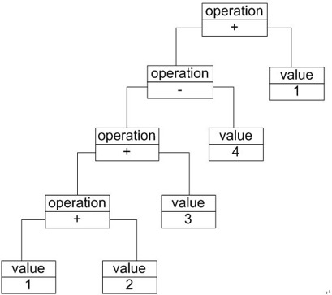
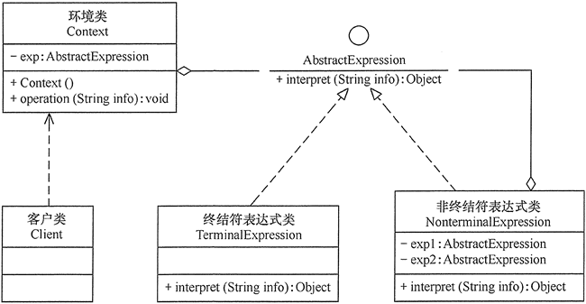

## 解释器模式

### 模式概述

我们知道，像C++、Java和C#等语言无法直接解释类似“1+ 2 + 3 – 4 + 1”这样的字符串（如果直接作为数值表达式时可以解释），我们必须自己定义一套文法规则来实现对这些语句的解释，即设计一个自定义语言。在实际开发中，这些简单的自定义语言可以基于现有的编程语言来设计，如果所基于的编程语言是面向对象语言，此时可以使用解释器模式来实现自定义语言。

定义：定义一个语言的文法，并且建立一个解释器来解释该语言中的句子，这里的“语言”是指使用规定格式和语法的代码。

解释器模式是一种使用频率相对较低但学习难度较大的设计模式，它用于描述如何使用面向对象语言构成一个简单的语言解释器。在某些情况下，为了更好地描述某一些特定类型的问题，我们可以创建一种新的语言，这种语言拥有自己的表达式和结构，即文法规则，这些问题的实例将对应为该语言中的句子。此时，可以使用解释器模式来设计这种新的语言。对解释器模式的学习能够加深我们对面向对象思想的理解，并且掌握编程语言中文法规则的解释过程。

在前面所提到的加法/减法解释器中，每一个输入表达式，例如“1 + 2 + 3 – 4 + 1”，都包含了三个语言单位，可以使用如下文法规则来定义：

expression ::= value | operation<br/>
operation ::= expression '+' expression | expression '-'   expression<br/>
value ::= an integer //一个整数值

该文法规则包含三条语句，第一条表示表达式的组成方式，其中value和operation是后面两个语言单位的定义，每一条语句所定义的字符串如operation和value称为语言构造成分或语言单位，符号“::=”表示“定义为”的意思，其左边的语言单位通过右边来进行说明和定义，语言单位对应终结符表达式和非终结符表达式。如本规则中的operation是非终结符表达式，它的组成元素仍然可以是表达式，可以进一步分解，而value是终结符表达式，它的组成元素是最基本的语言单位，不能再进行分解。

在文法规则定义中可以使用一些符号来表示不同的含义，如使用“|”表示或，使用“{”和“}”表示组合，使用“*”表示出现0次或多次等，其中使用频率最高的符号是表示“或”关系的“|”，如文法规则“boolValue ::= 0 | 1”表示终结符表达式boolValue的取值可以为0或者1。

除了使用文法规则来定义一个语言，在解释器模式中还可以通过一种称之为抽象语法树(Abstract Syntax Tree, AST)的图形方式来直观地表示语言的构成，每一棵抽象语法树对应一个语言实例，如加法/减法表达式语言中的语句“1+ 2 + 3 – 4 + 1”，可以通过如下图所示抽象语法树来表示：



由于表达式可分为终结符表达式和非终结符表达式，因此解释器模式的结构与组合模式的结构有些类似，但在解释器模式中包含更多的组成元素，它的结构如图所示：



* AbstractExpression（抽象表达式）：在抽象表达式中声明了抽象的解释操作，它是所有终结符表达式和非终结符表达式的公共父类。
* TerminalExpression（终结符表达式）：终结符表达式是抽象表达式的子类，它实现了与文法中的终结符相关联的解释操作，在句子中的每一个终结符都是该类的一个实例。通常在一个解释器模式中只有少数几个终结符表达式类，它们的实例可以通过非终结符表达式组成较为复杂的句子。
* NonterminalExpression（非终结符表达式）：非终结符表达式也是抽象表达式的子类，它实现了文法中非终结符的解释操作，由于在非终结符表达式中可以包含终结符表达式，也可以继续包含非终结符表达式，因此其解释操作一般通过递归的方式来完成。
* Context（环境类）：环境类又称为上下文类，它用于存储解释器之外的一些全局信息，通常它临时存储了需要解释的语句。

### 模式实现

在解释器模式中，每一种终结符和非终结符都有一个具体类与之对应，正因为使用类来表示每一条文法规则，所以系统将具有较好的灵活性和可扩展性。对于所有的终结符和非终结符，我们首先需要抽象出一个公共父类，即抽象表达式类，其典型代码如下所示：

```java
public abstract class AbstractExpression {
    public abstract void interpret(Context ctx);
}
```

终结符表达式和非终结符表达式类都是抽象表达式类的子类，对于终结符表达式，其代码很简单，主要是对终结符元素的处理，其典型代码如下所示：

```java
public class TerminalExpression extends   AbstractExpression {
    public   void interpret(Context ctx) {
        //终结符表达式的解释操作
    }
}
```

对于非终结符表达式，其代码相对比较复杂，因为可以通过非终结符将表达式组合成更加复杂的结构，对于包含两个操作元素的非终结符表达式类，其典型代码如下：

```java
public class NonterminalExpression extends  AbstractExpression {
    private AbstractExpression left; 
    private AbstractExpression right;

    public NonterminalExpression(AbstractExpression left, AbstractExpression right) {
        this.left=left;
        this.right=right;
    }

    public void interpret(Context ctx) {
        //递归调用每一个组成部分的interpret()方法
        //在递归调用时指定组成部分的连接方式，即非终结符的功能
    }
}
```

除了上述用于表示表达式的类以外，通常在解释器模式中还提供了一个环境类Context，用于存储一些全局信息，通常在Context中包含了一个HashMap或ArrayList等类型的集合对象（也可以直接由HashMap等集合类充当环境类），存储一系列公共信息，如变量名与值的映射关系（key/value）等，用于在进行具体的解释操作时从中获取相关信息。其典型代码片段如下：

```java
public class Context {
    private HashMap map = new HashMap();
    public void assign(String key, String value) {
        //往环境类中设值
    }
    public String lookup(String key) {
        //获取存储在环境类中的值
    }
}
```

当系统无须提供全局公共信息时可以省略环境类，可根据实际情况决定是否需要环境类。

### 模式总结

解释器模式为自定义语言的设计和实现提供了一种解决方案，它用于定义一组文法规则并通过这组文法规则来解释语言中的句子。

**主要优点**
1. 易于改变和扩展文法。由于在解释器模式中使用类来表示语言的文法规则，因此可以通过继承等机制来改变或扩展文法。
2. 每一条文法规则都可以表示为一个类，因此可以方便地实现一个简单的语言。
3. 实现文法较为容易。在抽象语法树中每一个表达式节点类的实现方式都是相似的，这些类的代码编写都不会特别复杂，还可以通过一些工具自动生成节点类代码。
4. 增加新的解释表达式较为方便。如果用户需要增加新的解释表达式只需要对应增加一个新的终结符表达式或非终结符表达式类，原有表达式类代码无须修改，符合“开闭原则”。

**主要缺点**
1. 对于复杂文法难以维护。在解释器模式中，每一条规则至少需要定义一个类，因此如果一个语言包含太多文法规则，类的个数将会急剧增加，导致系统难以管理和维护，此时可以考虑使用语法分析程序等方式来取代解释器模式。
2. 执行效率较低。由于在解释器模式中使用了大量的循环和递归调用，因此在解释较为复杂的句子时其速度很慢，而且代码的调试过程也比较麻烦。

**适用场景**
1. 可以将一个需要解释执行的语言中的句子表示为一个抽象语法树。
2. 一些重复出现的问题可以用一种简单的语言来进行表达。
3. 一个语言的文法较为简单。
4. 执行效率不是关键问题。

### 我的思考

绘制加法/减法解释器的类图并编写核心实现代码。

### 参考链接

[解释器模式-Interpreter Pattern](https://gof.quanke.name/%E8%A7%A3%E9%87%8A%E5%99%A8%E6%A8%A1%E5%BC%8F-Interpreter%20Pattern.html)
