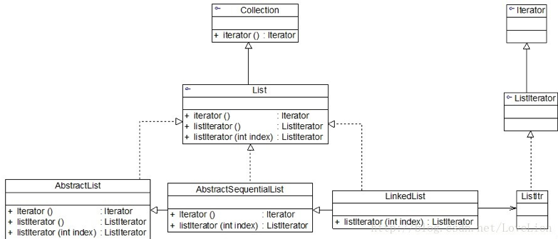

## 迭代器模式

在软件开发中，我们经常需要使用聚合对象来存储一系列数据。聚合对象拥有两个职责：一是存储数据；二是遍历数据。存储数据是聚合对象的基本要求，那么我们是否可以考虑将遍历数据的行为从聚合对象中分离出来，封装在一个被称之为“迭代器”的对象中，由迭代器来提供遍历聚合对象内部数据的行为，本篇就要介绍一种用来访问聚合对象，而不用暴露这个对象的内部表示的设计模式一一迭代器模式。

在迭代器模式结构中包含聚合和迭代器两个层次结构，其模式结构如图所示：


1. Iterator（抽象迭代器）：它定义了访问和遍历元素的接口，声明了用于遍历数据元素的方法，例如用于访问下一个元素的next()方法，用于判断是否还有下一个元素的hasNext()方法。
2. ConcreteIterator（具体迭代器）：它实现了抽象迭代器接口，完成对聚合对象的遍历，同时在具体迭代器中通过游标（类似）来记录在聚合对象中所处的当前位置。
3. Aggregate（抽象聚合类）：它用于存储和管理元素对象，声明一个createIterator()方法用于创建一个迭代器对象，充当抽象迭代器工厂角色，例如JDK中的Collection接口。
4. ConcreteAggregate（具体聚合类）：它实现了在抽象聚合类中声明的createIterator()方法，该方法返回一个与该具体聚合类对应的具体迭代器ConcreteIterator实例。


### 模式实现

下面结合代码来对迭代器模式的结构进行进一步分析，首先在抽象迭代器中声明用于遍历聚合对象中所存储元素的方法，代码如下：

```java
public interface Iterator<E> {

    /**
     * 返回下一个元素
     *
     * @return 下一个元素
     */
    E next();

    /**
     * 判断是否存在下一个元素
     *
     * @return true or false
     */
    boolean hasNext();

}
```


在具体迭代器中将实现抽象迭代器声明的遍历数据的方法，代码如下：

```java
public class ConcreteIterator<E> implements Iterator<E> {

    /**
     * 定义游标，初始值-1
     */
    private int cursor = -1;

    /**
     * 维持一个对具体聚合对象的引用
     */
    private ConcreteAggregate<E> aggregate;

    public ConcreteIterator(ConcreteAggregate<E> aggregate) {
        this.aggregate = aggregate;
    }

    @Override
    public E next() {
        return aggregate.list.get(++cursor);
    }

    @Override
    public boolean hasNext() {
        return cursor + 1 < aggregate.list.size();
    }
}
```


聚合类用于存储数据并负责创建迭代器对象，最简单的抽象聚合类代码如下所示：

```java
public interface Aggregate<E> {

    Iterator<E> createIterator();
}
```

具体聚合类作为抽象聚合类的子类，一方面负责存储数据，另一方面实现了在抽象聚合类中声明的工厂方法createIterator()，用于返回一个与该具体聚合类对应的具体迭代器对象，代码如下所示：

```java
public class ConcreteAggregate implements Aggregate {

    List<E> list = new ArrayList<>();

    public void add(E e) {
        list.add(e);
    }

    @Override
    public Iterator<E> createIterator() {
        return new ConcreteIterator<>(this);
    }
}
```

编写主函数或测试类：

```java
public class Main {

    public static void main(String[] args) {
        ConcreteAggregate<String> aggregate = new ConcreteAggregate<>();
        aggregate.add("钱");
        aggregate.add("立");
        aggregate.add("清");
        ConcreteIterator<String> iterator = new ConcreteIterator<>(aggregate);
        while (iterator.hasNext()) {
            // 打印“钱立清”
            System.out.print(iterator.next());
        }
    }
}
```

### JDK内置迭代器

为了让开发人员能够更加方便地操作聚合对象，在Java、C#等编程语言中都提供了内置迭代器。在Java集合框架中，常用的List和Set等聚合类都继承（或实现）了java.util.Collection接口，在Collection接口中声明了如下方法（部分）：

```java
package java.util;

public interface Collection<E> extends Iterable<E> {
    boolean add(Object c); 
    boolean addAll(Collection c); 
    boolean remove(Object o);
    boolean removeAll(Collection c); 
    boolean remainAll(Collection c); 
    Iterator iterator();
}

```

除了包含一些增加元素和删除元素的方法外，还提供了一个iterator()方法，用于返回一个Iterator迭代器对象，以便遍历聚合中的元素；具体的Java聚合类可以通过实现该iterator()方法返回一个具体的Iterator对象。JDK中定义了抽象迭代器接口Iterator，代码如下所示：

```java
package java.util;

public interface Iterator<E> { 
    boolean hasNext();
    E next(); 
    default void remove() {
        throw new UnsupportedOperationException("remove");
    }
}
```

其中，hasNext()用于判断聚合对象中是否还存在下一个元素，为了不抛出异常，在每次调用next()之前需先调用hasNext()，如果有可供访问的元素，则返回true；next()方法用于将游标移至下一个元素，通过它可以逐个访问聚合中的元素，它返回游标所越过的那个元素的引用；remove()方法会抛出“操作不支持”的异常。

在JDK中，Collection接口和Iterator接口充当了迭代器模式的抽象层，分别对应于抽象聚合类和抽象迭代器，而Collection接口的子类充当了具体聚合类，下面以List为例加以说明，图中列出了JDK中部分与List有关的类及它们之间的关系：


当然实际情况比图要复杂很多，在图中，List接口除了继承Collection接口的iterator()方法外，还增加了新的工厂方法listIterator()，专门用于创建ListIterator类型的迭代器，在List的子类ArrayList、LinkedList都实现了该方法，可用于创建具体的ListIterator子类ListItr的对象，代码如下所示：

```java
public ListIterator<E> listIterator(int index) { 
    return new ListItr(index);
}
```

ListIterator提供了更加丰富的功能，可以看下ListIterator迭代器的代码：

```java
public interface ListIterator<E> extends Iterator<E> {
    boolean hasNext();
    E next(); 
    void remove();
    boolean hasPrevious();
    E previous();
    int nextIndex();
    int previousIndex();
    void set(E e);
    void add(E e);
}
```

List的实现类ArrayList中的ListIterator迭代器实现代码如下：

```java
private class ListItr extends Itr implements ListIterator<E> {
        ListItr(int index) {
            super();
            cursor = index;
        }

        public boolean hasPrevious() {
            return cursor != 0;
        }

        public int nextIndex() {
            return cursor;
        }

        public int previousIndex() {
            return cursor - 1;
        }

        @SuppressWarnings("unchecked")
        public E previous() {
            checkForComodification();
            int i = cursor - 1;
            if (i < 0)
                throw new NoSuchElementException();
            Object[] elementData = ArrayList.this.elementData;
            if (i >= elementData.length)
                throw new ConcurrentModificationException();
            cursor = i;
            return (E) elementData[lastRet = i];
        }

        public void set(E e) {
            if (lastRet < 0)
                throw new IllegalStateException();
            checkForComodification();

            try {
                ArrayList.this.set(lastRet, e);
            } catch (IndexOutOfBoundsException ex) {
                throw new ConcurrentModificationException();
            }
        }

        public void add(E e) {
            checkForComodification();

            try {
                int i = cursor;
                ArrayList.this.add(i, e);
                cursor = i + 1;
                lastRet = -1;
                expectedModCount = modCount;
            } catch (IndexOutOfBoundsException ex) {
                throw new ConcurrentModificationException();
            }
        }
    }
```

### 模式总结

迭代器模式是一种使用频率非常高的设计模式，通过引入迭代器可以将数据的遍历功能从聚合对象中分离出来，聚合对象只负责存储数据，而遍历数据由迭代器来完成。由于很多编程语言的类库都已经实现了迭代器模式，因此在实际开发中，我们只需要直接使用Java、C#等语言已定义好的迭代器即可，迭代器已经成为我们操作聚合对象的基本工具之一。

**主要优点**

1. 支持以不同的方式遍历一个聚合对象，在同一个聚合对象上可以定义多种遍历方式。在迭代器模式中只需要用一个不同的迭代器来替换原有迭代器即可改变遍历算法，我们也可以自己定义迭代器的子类以支持新的遍历方式。
2. 迭代器简化了聚合类。由于引入了迭代器，在原有的聚合对象中不需要再自行提供数据遍历等方法，这样可以简化聚合类的设计。
3. 在迭代器模式中，由于引入了抽象层，增加新的聚合类和迭代器类都很方便，无须修改原有代码，满足“开闭原则”的要求。

**主要缺点**

1. 由于迭代器模式将存储数据和遍历数据的职责分离，增加新的聚合类需要对应增加新的迭代器类，类的个数成对增加，这在一定程度上增加了系统的复杂性。
2. 抽象迭代器的设计难度较大，需要充分考虑到系统将来的扩展，例如JDK内置迭代器Iterator就无法实现逆向遍历，如果需要实现逆向遍历，只能通过其子类ListIterator等来实现，而ListIterator迭代器无法用于操作Set类型的聚合对象。在自定义迭代器时，创建一个考虑全面的抽象迭代器并不是件很容易的事情。

**适用场景**

1. 访问一个聚合对象的内容而无须暴露它的内部表示。将聚合对象的访问与内部数据的存储分离，使得访问聚合对象时无须了解其内部实现细节。
2. 需要为一个聚合对象提供多种遍历方式。
3. 为遍历不同的聚合结构提供一个统一的接口，在该接口的实现类中为不同的聚合结构提供不同的遍历方式，而客户端可以一致性地操作该接口。

### 参考链接

[迭代器模式-Iterator Pattern](https://gof.quanke.name/%E8%BF%AD%E4%BB%A3%E5%99%A8%E6%A8%A1%E5%BC%8F-Iterator%20Pattern.html)