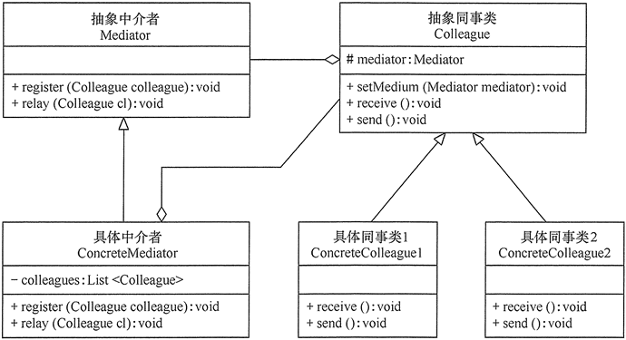

## 中介者模式

### 模式概述
在有些软件中，某些类/对象之间的相互调用关系错综复杂，呈现出“网状结构”。这种结构下对象之间存在大量的多对多联系，导致系统非常复杂，这些对象既会影响别的对象，也会被别的对象所影响，这些对象称为同事对象。此时，我们特别需要一个中间类来协调这些类/对象之间的复杂关系，以降低系统的耦合度。有一个设计模式正为此而诞生，它就是本章将要介绍的中介者模式。

中介者模式可以使对象之间的关系数量急剧减少，通过引入中介者对象，可以将系统的网状结构变成以中介者为中心的“星形结构”。在星形结构中，同事对象不再直接与另一个对象联系，它通过中介者对象与另一个对象发生相互作用。中介者对象的存在保证了对象结构上的稳定，也就是说，系统的结构不会因为新对象的引入带来大量的修改工作。

以租房中介为例，假如没有租房中介，这里有六个房东需要出租房屋，并且这六个房东之间刚好有点联系。这时租客A来租房，看了一号房东的房子不满意，但是一号房东觉得可以让他去看看其他五个朋友的房间。然后开始联系他的五个朋友，这种情况下貌似没有什么问题。但是如果其中二号房东的房屋不出租或者已经出租，这时他则需要通知其他五个朋友，告诉他们不用再给他介绍租客。这里就造成了中间一个人发生了变化，需要改动其他五个人，那么如何解决这种情况呢？我们尝试把中介加进来，六个房东都把房屋交给中介处理，租客A看房间一不满意直接通过中介看房间二。如果租客确定要租房间二，那么直接由中介通知房东二号，后续也就不会再带租客看房间二了。这里一个出现了变化也就影响改变了一个，并不会影响其他另外五个房东。这个例子可以更好的帮助我们理解中介者模式，可以从以下两幅图直观的来了解中介者的作用。<br/>

图一：不采用中介的房东租房模式，多对多，关系复杂


图二：采用中介的租房模式，一对多，相对简单


我想现在对中介者模式应该有了初步的认识，中介者模式通过一个中介对象（中介者）来封装一系列的对象交互，使各对象不需要显式地相互引用，从而使其耦合松散，而且可以独立地改变它们之间的交互。

在中介者模式中，核心就是引入了用于协调其他对象/类之间相互调用的中介者类，为了让系统具有更好的灵活性和可扩展性，通常还提供抽象中介者，其结构图如下：


1. Mediator（抽象中介者）：它定义一个接口，该接口用于与各同事对象之间进行通信。
2. ConcreteMediator（具体中介者）：它是抽象中介者的子类，通过协调各个同事对象来实现协作行为，它维持了对各个同事对象的引用。
3. Colleague（抽象同事类）：它定义各个同事类公有的方法，并声明了一些抽象方法来供子类实现，同时它维持了一个对抽象中介者类的引用，其子类可以通过该引用来与中介者通信。
4. ConcreteColleague（具体同事类）：它是抽象同事类的子类；每一个同事对象在需要和其他同事对象通信时，先与中介者通信，通过中介者来间接完成与其他同事类的通信；在具体同事类中实现了在抽象同事类中声明的抽象方法。

### 模式实现

在抽象中介者中可以定义一个同事类的集合，用于存储同事对象并提供注册方法，代码如下：

```java
public abstract class Mediator {

    // 用于存储同事对象
    protected List<Colleague> colleagues = new ArrayList<>();

    // 注册方法，用于增加同事对象
    public void register(Colleague colleague) {
        colleagues.add(colleague);
    }

    // 声明抽象的业务方法
    public abstract void common();
}
```

具体中介者继承抽象中介者并实现抽象业务方法，调用时可以增加一些自己的业务代码对调用进行控制，代码如下：

```java
public class ConcreteMediator extends Mediator {

    @Override
    public void common() {
        // 增加自己的业务代码
        // ...
        assert colleagues.size() > 0;
        // 通过中介者调用同事对象
        colleagues.get(0).handle();
        // 增加自己的业务代码
        // ...
    }
}
```

在抽象同事类中维持了一个抽象中介者的引用，用于调用中介者的方法，代码如下：

```java
public abstract class Colleague {

    // 维持一个抽象中介者的引用
    protected Mediator mediator;

    public Colleague(Mediator mediator) {
        this.mediator = mediator;
    }

    // 声明自身方法，处理自己的行为
    public abstract void handle();

    // 定义依赖方法，与中介者进行通信
    public void notifyMediator() {
        // mediator.common();
    }
}
```

在具体同事类中实现抽象同事类中声明的方法，其中方法handle()是同事类的自身方法(Self-Method)，用于处理自己的行为，而方法notifyMediator()是依赖方法(Depend-Method)，用于调用在中介者中定义的方法，依赖中介者来完成相应的行为，例如调用另一个同事类的相关方法，代码如下：

```java
public class ConcreteColleague extends Colleague {

    public ConcreteColleague(Mediator mediator) {
        super(mediator);
    }

    @Override
    public void handle() {
        System.out.println("Do my own thing");
    }
}
```

### 模式总结

中介者模式将一个网状的系统结构变成一个以中介者对象为中心的星形结构，使用中介者对象与其他对象的一对多关系来取代原有对象之间的多对多关系。

**主要优点**

1. 中介者模式简化了对象之间的交互，它用中介者和同事的一对多交互代替了原来同事之间的多对多交互，一对多关系更容易理解、维护和扩展，将原本复杂的网状结构转换成相对简单的星型结构。
2. 中介者模式可将各同事对象解耦。中介者有利于各同事之间的松耦合，我们可以独立的改变和复用每一个同事和中介者，增加新的中介者和新的同事类都比较方便，更好地符合“开闭原则”。


**主要缺点**

在具体中介者类中包含大量同事之间的交互细节，可能会导致具体中介者类非常复杂。

**适用场景**

1. 系统中对象之间存在复杂的引用关系，系统结构混乱且难以理解。
2. 一个对象由于引用了其他很多对象并且直接和这些对象通信，导致难以复用该对象。
3. 想通过一个中间类来封装多个类中的行为，而又不想生成太多的子类。可以通过引入中介者类来实现，在中介者中定义对象交互的公共行为，如果需要改变行为则可以增加新的具体中介者类。

### 参考链接

[中介者模式-Mediator Pattern](https://gof.quanke.name/%E4%B8%AD%E4%BB%8B%E8%80%85%E6%A8%A1%E5%BC%8F-Mediator%20Pattern.html)


