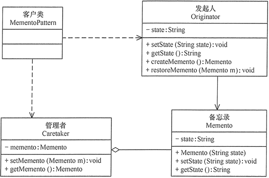

## 备忘录模式

### 模式概述

本文要介绍GoF的23种设计模式的最后一种一一备忘录模式。

那什么是备忘录模式？备忘录模式的定义是指在不破坏封装性的前提下，捕获一个对象的内部状态，并在该对象之外保存这个状态，以便以后当需要时能将该对象恢复到原先保存的状态。简单的说，就是通过记录一个对象的内部状态，当用户后悔时能撤销当前操作，使数据恢复到它原先的状态。

所以，备忘录模式是一种状态恢复的实现机制，使得用户可以方便地回到一个特定的历史步骤，当新的状态无效或者存在问题时，可以使用暂时存储起来的备忘录将状态复原。其核心就是备忘录类以及用于管理备忘录的管理者类的设计，其结构如图所示：


1. Originator（发起人）：记录当前时刻的内部状态信息，提供创建备忘录和恢复备忘录数据的功能，实现其他业务功能，它可以访问备忘录里的所有信息。
2. Memento（备忘录)：负责存储发起人的内部状态，只直接提供给发起人，不能直接供其他类使用。
3. Caretaker（管理者）：管理者又称负责人，它负责保存一个或多个备忘录，但是不能对备忘录的内容进行操作或检查，也无须知道对象的实现细节。

### 模式实现

首先定义一个发起人类Originator，它包含一些用于存储成员数据的属性，代码如下：

```java
public class Originator {

    private String state;

    public void setState(String state) {
        this.state = state;
    }

    public String getState() {
        return state;
    }

    public Memento createMemento() {
        return new Memento(state);
    }

    public void restoreMemento(Memento m) {
        this.setState(m.getState());
    }
}
```

对于备忘录类Memento而言，它主要负责存储与发起人相对应的属性（可以是全部，也可以是部分），代码如下：

```java
public class Memento {

    private String state;

    public Memento(String state) {
        this.state = state;
    }

    public void setState(String state) {
        this.state = state;
    }

    public String getState() {
        return state;
    }
}
```

注意：考虑到备忘录类Memento的封装性，除了Originator类，不允许其他类来调用Memento类的构造函数与相关方法。所以，在使用Java语言实现备忘录模式时，一般通过将Memento类与Originator类定义在同一个包(package)中来实现封装，在Java语言中可使用默认访问标识符来定义Memento类，即保证其包内可见。

对于管理者类Caretaker，它也不应该直接调用Memento中的状态改变方法，而仅仅是用于保存备忘录对象，并提供getMemento()方法用于向客户端返回一个备忘录对象，发起人类通过使用这个备忘录对象可以回到某个历史状态，其实现代码如下：

```java
public class Caretaker {

    private Memento memento;

    public void setMemento(Memento m) {
        memento = m;
    }

    public Memento getMemento() {
        return memento;
    }
}
```

### 模式总结

如果需要为软件提供撤销功能，备忘录模式无疑是一种很好的解决方案。

**主要优点**

1. 它提供了一种状态恢复的实现机制，使得用户可以方便地回到一个特定的历史步骤，当新的状态无效或者存在问题时，可以使用暂时存储起来的备忘录将状态复原。
2. 备忘录实现了对信息的封装，一个备忘录对象是一种发起人对象状态的表示，不会被其他代码所改动。备忘录保存了发起人的状态，采用列表、堆栈等集合来存储备忘录对象可以实现多次撤销操作。

**主要缺点**

资源消耗过大，如果需要保存的发起人类的成员变量太多，就不可避免需要占用大量的存储空间，每保存一次对象的状态都需要消耗一定的系统资源。

**适用场景**

1. 保存一个对象在某一个时刻的全部状态或部分状态，这样以后需要时它能够恢复到先前的状态，实现撤销操作。
2. 防止外界对象破坏一个对象历史状态的封装性，避免将对象历史状态的实现细节暴露给外界对象。

### 参考链接

[备忘录模式-Memento Pattern](https://gof.quanke.name/%E5%A4%87%E5%BF%98%E5%BD%95%E6%A8%A1%E5%BC%8F-Memento%20Pattern.html)