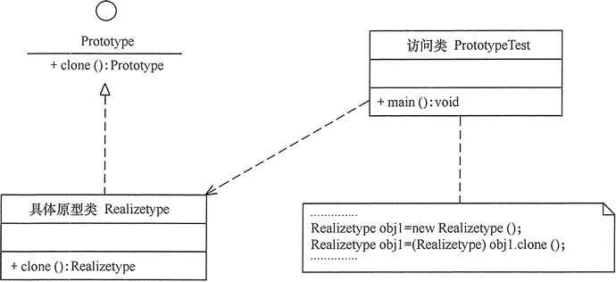
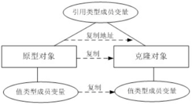
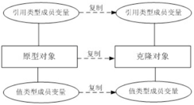

## 原型模式

### 模式概述

定义：使用原型实例指定创建对象的种类，并且通过拷贝这些原型创建新的对象。

在使用原型模式时，我们需要首先创建一个原型对象，再通过复制这个原型对象来创建更多同类型的对象。

原型模式的工作原理很简单：将一个原型对象传给那个要发动创建的对象，这个要发动创建的对象通过请求原型对象拷贝自己来实现创建过程。

需要注意的是通过克隆方法所创建的对象是全新的对象，它们在内存中拥有新的地址，**通常**对克隆所产生的对象进行修改对原型对象不会造成任何影响，每一个克隆对象都是相互独立的。（注意是通常）

带原型管理器的原型模式的结构如图所示：<br/>


在原型模式结构图中包含如下几个角色：
* Prototype（抽象原型类）：它是声明克隆方法的接口，是所有具体原型类的公共父类，可以是抽象类也可以是接口，甚至还可以是具体实现类。
* ConcretePrototype（具体原型类）：它实现在抽象原型类中声明的克隆方法，在克隆方法中返回自己的一个克隆对象。
* Client（客户类）：让一个原型对象克隆自身从而创建一个新的对象，在客户类中只需要直接实例化或通过工厂方法等方式创建一个原型对象，再通过调用该对象的克隆方法即可得到多个相同的对象。

### 模式实现

原型模式的核心在于如何实现克隆方法，下面将介绍两种在Java语言中常用的克隆实现方法：

#### 1. 创建新对象并为其注入属性。

通用的克隆实现方法是在具体原型类的克隆方法中实例化一个与自身类型相同的对象并将其返回，并将相关的参数传入新创建的对象中，保证它们的成员属性相同。示例代码如下所示：

```java
public Shape clone() {
    Shape shape = new Circle();
    shape.setAttr(this.attr);
    return shape;
}
```

这种方式可作为原型模式的通用实现，不仅限于Java语言，但是其存在一个缺点就是克隆方法中要指定具体原型类。

#### 2. 实现clone()方法。

Java Object类提供一个clone()方法，可以将一个Java对象复制一份。因此在Java中可以直接使用Object提供的clone()方法来实现对象的克隆。示例代码如下所示：

```java
public abstract class Shape implements Cloneable {

    // ...

    @Override
    public Object clone() {
        Object clone = null;
        try {
            clone = super.clone();
        } catch (CloneNotSupportedException e) {
            e.printStackTrace();
        }
        return clone;
    }
}
```

注意：实现克隆方法的Java类必须实现一个Cloneable接口，并需要捕获CloneNotSupportedException异常。

一般而言，Java语言中的clone()方法满足：<br/>
(1) 对任何对象x，都有x.clone() != x，即克隆对象与原型对象不是同一个对象；<br/>
(2) 对任何对象x，都有x.clone().getClass() == x.getClass()，即克隆对象与原型对象的类型一样；<br/>
(3) 如果对象x的equals()方法定义恰当，那么x.clone().equals(x)应该成立。

### 深克隆和浅克隆

第二节要介绍一下两种不同的克隆方法，浅克隆(ShallowClone)和深克隆(DeepClone)。在Java语言中，数据类型分为值类型（基本数据类型）和引用类型，值类型包括int、double、byte、boolean、char等简单数据类型，引用类型包括类、接口、数组等复杂类型。浅克隆和深克隆的主要区别在于是否支持引用类型的成员变量的复制。

另外要特别注意的是，若变量为String类型时，拷贝的是其地址引用。但是在修改时，它会从字符串池中重新生成一个新的字符串，原有对象保持不变。

#### 3.1 浅克隆

在浅克隆中，如果原型对象的成员变量是值类型，将复制一份给克隆对象；如果原型对象的成员变量是引用类型，则将引用对象的地址复制一份给克隆对象，也就是说原型对象和克隆对象的成员变量指向相同的内存地址。简单来说，在浅克隆中，当对象被复制时只复制它本身和其中包含的值类型的成员变量，而引用类型的成员对象并没有复制，如图所示：<br/>


在Java语言中，通过覆盖Object类的clone()方法可以实现浅克隆。

#### 3.2 深克隆

在深克隆中，无论原型对象的成员变量是值类型还是引用类型，都将复制一份给克隆对象。简单来说，在深克隆中，除了对象本身被复制外，对象所包含的所有成员变量也将复制，如图所示：<br/>


在Java语言中，如果需要实现深克隆，可以通过序列化(Serialization)等方式来实现。序列化就是将对象写到流的过程，写到流中的对象是原有对象的一个拷贝，而原对象仍然存在于内存中。需要注意的是能够实现序列化的对象必须实现Serializable接口，否则无法实现序列化操作。

深克隆示例代码如下：

```java
public abstract class Shape implements Serializable {
    // ...
}
```

```java
Circle circle = new Circle();

Circle clonedCircle;
try {
    ByteArrayOutputStream baos = new ByteArrayOutputStream();
    ObjectOutputStream oos = new ObjectOutputStream(baos);
    oos.writeObject(circle);
    oos.close();

    ByteArrayInputStream bais = new ByteArrayInputStream(baos.toByteArray());
    ObjectInputStream ois = new ObjectInputStream(bais);
    clonedCircle = (Circle) ois.readObject();
    ois.close();

    System.out.println("clone type: " + clonedCircle.getType());
} catch (IOException | ClassNotFoundException e) {
    e.printStackTrace();
}
```

### 模式总结

原型模式作为一种快速创建大量相同或相似对象的方式，在软件开发中应用较为广泛。

1.主要优点<br/>
(1) 当创建新的对象实例较为复杂时，使用原型模式可以简化对象的创建过程，通过复制一个已有实例可以提高新实例的创建效率。<br/>
(2) 扩展性较好，原型类抽象化，使得在客户端可以针对抽象原型类进行编程，而将具体原型类写在配置文件中，增加或减少产品类对原有系统都没有任何影响。<br/>
(3) 使用深克隆的方式可以保存对象的状态。

2.主要缺点<br/>
(1) 克隆方法位于一个类的内部，当对已有的类进行改造时，需要修改源代码，违背了“开闭原则”。<br/>
(2) 在实现深克隆时需要编写较为复杂的代码，尤其是在对象之间存在多重嵌套引用时，每一层对象对应的类都必须支持深克隆。

3.适用场景<br/>
(1) 创建新对象成本较大（如初始化需要占用较长的时间，占用太多的CPU资源或网络资源），新的对象可以通过原型模式对已有对象进行复制来获得。<br/>
(2) 如果系统要保存对象的状态，而对象的状态变化很小，或者对象本身占用内存较少时，可以使用原型模式配合备忘录模式来实现。

### 思考

```java
public Shape clone() {
    Shape shape = new Circle();
    shape.setAttr(this.attr);
    return shape;
}
```

能否将上述代码中的clone()方法写成以下形式，给出你的理由。

```java
public Shape clone() { 
    return this; 
}
```

### 参考链接
[原型模式-Prototype Pattern](https://gof.quanke.name/%E5%8E%9F%E5%9E%8B%E6%A8%A1%E5%BC%8F-Prototype%20Pattern.html)