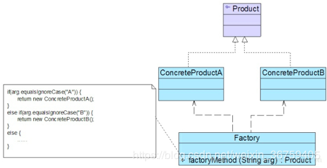

## 简单工厂模式

### 模式概述

定义：定义一个工厂类，它可以根据参数的不同返回不同类的实例，被创建的实例通常都具有共同的父类。因为在简单工厂模式中用于创建实例的方法是静态方法，因此简单工厂模式又被称为静态工厂方法模式。

简单工厂模式并不属于GoF 23个经典设计模式，但通常将它作为学习其他工厂模式的基础，它的设计思想很简单，其基本流程如下：首先将需要创建的各种不同对象（例如各种不同的Shape对象）的相关代码封装到不同的类中，这些类称为具体产品类，而将它们公共的代码进行抽象和提取后封装在一个抽象产品类中，每一个具体产品类都是抽象产品类的子类；然后提供一个工厂类用于创建各种产品，在工厂类中提供一个创建产品的工厂方法，该方法可以根据所传入的参数不同创建不同的具体产品对象；客户端只需调用工厂类的工厂方法并传入相应的参数即可得到一个产品对象。

简单工厂模式结构比较简单，其核心是工厂类的设计，其结构如图所示：<br/>


在简单工厂模式中包含如下几个角色：
* Factory（工厂类）：负责实现创建所有产品实例的内部逻辑，在工厂类中提供静态的工厂方法，返回抽象产品。
* Product（抽象产品）：所有具体产品的父类，封装各种产品对象的共有方法。
* ConcreteProduct（具体产品类）：工厂类的创建目标。

### 模式实现

在简单工厂模式中，客户端通过工厂类来创建一个产品类的实例，而无须直接使用new关键字来创建对象。

在使用简单工厂模式时，首先需要对产品类进行重构，根据实际情况设计一个产品层次结构，将所有产品类公共的代码移至抽象产品类，并在抽象产品类中声明一些抽象方法，以供不同的具体产品类来实现，典型的抽象产品类代码如下所示：
```java
public abstract class Shape {
    // 公共方法
    public void show() {
        
    }
    // 抽象方法
    public abstract void draw();
}
```

具体产品类继承抽象产品类并实现抽象方法，不同的具体产品类可以提供不同的实现，典型的具体产品类代码如下所示：
```java
public class Circle extends Shape {

    @Override
    public void draw() {
        System.out.println("Inside Circle::draw() method.");
    }
}
```
```java
public class Rectangle extends Shape {

    @Override
    public void draw() {
        System.out.println("Inside Rectangle::draw() method.");
    }
}
```
```java
public class Square extends Shape {

    @Override
    public void draw() {
        System.out.println("Inside Square::draw() method.");
    }
}
```

简单工厂模式的核心工厂类负责创建产品，提供一个静态工厂方法给客户端使用，典型的工厂类代码如下所示：
```java
public class ShapeFactory {

    public static Shape getShape(String shapeType) {
        if (shapeType == null) {
            return null;
        }
        if (shapeType.equalsIgnoreCase("CIRCLE")) {
            return new Circle();
        } else if (shapeType.equalsIgnoreCase("RECTANGLE")) {
            return new Rectangle();
        } else if (shapeType.equalsIgnoreCase("SQUARE")) {
            return new Square();
        }
        return null;
    }
}
```

在客户端代码中，我们通过传入不同的参数给工厂方法来创建对应的产品，典型的代码如下所示：
```java
public class Client {

    public static void main(String[] args) {
        Shape rectangle = ShapeFactory.getShape("Rectangle");
        rectangle.draw();

        Shape circle = ShapeFactory.getShape("Circle");
        circle.draw();

        Shape square = ShapeFactory.getShape("Square");
        square.draw();
    }
}
```

### 方案改进

当我们更换一个Shape对象都需要修改客户端代码中静态工厂方法的参数，客户端代码将要重新编译，这对于客户端而言，违反了“开闭原则”，有没有一种方法能够在不修改客户端代码的前提下更换具体产品对象呢？

我们可以将静态工厂方法的参数存储在XML或properties格式的配置文件中，如下config.xml所示：
```xml
<?xml version="1.0"?>
<config>
  <chartType>square</chartType>
</config>
```

在通过一个工具类XMLUtil来读取配置文件中的字符串参数，XMLUtil类的代码如下所示：

```java
public class XMLUtil {

    public static String getChartType() {
        try {
            // 创建文档对象
            DocumentBuilderFactory dFactory = DocumentBuilderFactory.newInstance();
            DocumentBuilder builder = dFactory.newDocumentBuilder();
            Document doc;
            // config.xml的路径
            doc = builder.parse(new File("config.xml"));
            // 获取包含图表类型的文本节点
            NodeList nl = doc.getElementsByTagName("shapeType");
            Node classNode = nl.item(0).getFirstChild();
            String shapeType = classNode.getNodeValue().trim();
            return shapeType;
        } catch (Exception e) {
            e.printStackTrace();
            return null;
        }
    }
}
```

客户端通过读取配置文件中的shapeType创建对应的产品，客户端修改代码如下：
```java
public class Client {

    public static void main(String[] args) {
        String shapeType = XMLUtil.getChartType();
        Shape shape =  ShapeFactory.getShape(shapeType);
        shape.draw();
    }
}
```
优化之后，如果需要更换具体图表对象，只需修改配置文件config.xml，无须修改任何源代码，符合“开闭原则”。

还有另外一种情况，当系统中需要引入新产品时，比如引入新产品Triangle，由于静态工厂方法通过所传入参数的不同来创建不同的产品，那么势必要在工厂类中新增一个if...else判断来返回Triangle实例，违背了“开闭原则”。

在工厂类中新增if...else判断的代码如下：
```java
public class ShapeFactory {

    public static Shape getShape(String shapeType) {
        if (shapeType == null) {
            return null;
        }
        if (shapeType.equalsIgnoreCase("CIRCLE")) {
            return new Circle();
        } else if (shapeType.equalsIgnoreCase("RECTANGLE")) {
            return new Rectangle();
        } else if (shapeType.equalsIgnoreCase("SQUARE")) {
            return new Square();
        } else if (shapeType.equalsIgnoreCase("TRIANGLE")) {
            return new Triangle();
        }
        return null;
    }
}
```
一旦产品类型较多时，工厂类会变得不易维护。

我们可以通过反射机制解加增加新产品时需要改动静态工厂方法的缺点，修改静态工厂方法代码如下：
```java
public static <T> T getClass(Class<? extends T> clazz) {
    T obj = null;
    try {
        obj = (T) Class.forName(clazz.getName()).newInstance();
    } catch (InstantiationException | IllegalAccessException | ClassNotFoundException e) {
        e.printStackTrace();
    }
    return obj;
}
```

对应的客户端通过传入具体的产品类创建不同的产品，客户端代码修改如下：
```java
public class Client {

    public static void main(String[] args) {
        String shape = ShapeFactory.getClass(Circle.class);
        shape.draw();
    }
}
```

反射机制可以结合配置文件来更换具体的产品对象，而不需要改动客户端代码。

### 模式总结
    
简单工厂模式提供专门的工厂类用于创建对象，将对象的创建和对象的使用分离开。

1.主要优点<br/>
(1) 工厂类包含必要的判断逻辑，可以决定在什么时候创建哪一个产品类的实例，客户端可以免除直接创建产品对象的职责，而仅仅“消费”产品，简单工厂模式实现了对象创建和使用的分离。<br/>
(2) 客户端无须知道所创建的具体产品类的类名，只需要知道具体产品类所对应的参数即可，对于一些复杂的类名，通过简单工厂模式可以在一定程度减少使用者的记忆量。<br/>
(3) 通过引入配置文件，可以在不修改任何客户端代码的情况下更换和增加新的具体产品类，在一定程度上提高了系统的灵活性。

2.主要缺点<br/>
(1) 由于工厂类集中了所有产品的创建逻辑，如果工厂类不能工作，整个系统都要受到影响。<br/>
(2) 当系统中需要引入新产品时，由于静态工厂方法通过所传入参数的不同来创建不同的产品，这必定要修改工厂类的源代码（反射方式除外）。<br/>
(3) 在产品类型较多时，有可能造成工厂逻辑过于复杂，不利于系统的扩展和维护。

3.适用场景<br/>
(1) 工厂类负责创建的对象比较少时，不会造成工厂方法中的业务逻辑太过复杂，这个时候可以考虑使用简单工厂。<br/>
(2) 客户端对于如何创建对象并不关心。

### 参考链接
[简单工厂模式-Simple Factory Pattern](https://gof.quanke.name/%E7%AE%80%E5%8D%95%E5%B7%A5%E5%8E%82%E6%A8%A1%E5%BC%8F-Simple%20Factory%20Pattern.html)
