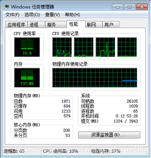
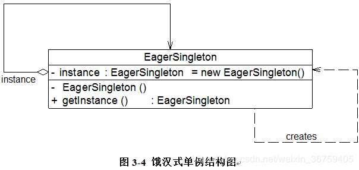
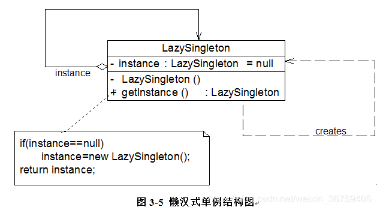
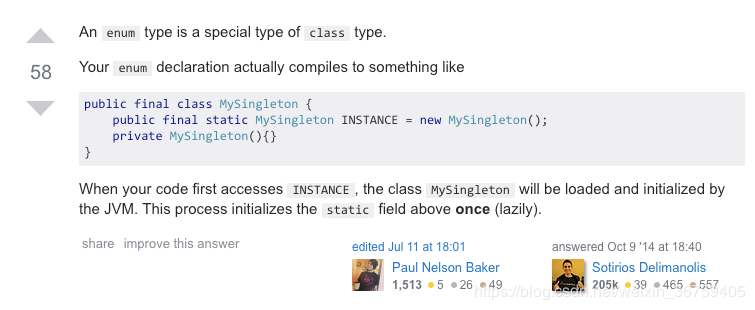

## 单例模式

对于一个软件系统的某些类而言，我们无须创建多个实例。举个大家都熟知的例子——Windows任务管理器，如图所示。<br/>


通常情况下，无论我们启动任务管理多少次，Windows系统始终只能弹出一个任务管理器窗口。为什么要这样设计呢？我们可以从以下两个方面来分析：其一，如果能弹出多个窗口，且这些窗口的内容完全一致，全部是重复对象，这势必会浪费系统资源，任务管理器需要获取系统运行时的诸多信息，这些信息的获取需要消耗一定的系统资源，包括CPU资源及内存资源等；其二，如果弹出的多个窗口内容不一致，这就意味着在某一瞬间系统资源使用情况和进程、服务等信息存在多个状态，例如任务管理器窗口A显示“CPU使用率”为10%，窗口B显示“CPU使用率”为15%，到底哪个才是真实的呢？

### 模式概述

定义：确保某一个类只有一个实例，而且自行实例化并向整个系统提供这个实例，这个类称为单例类，它提供全局访问的方法。单例模式是一种对象创建型模式。

### 模式实现

下面我们来模拟实现Windows任务管理器，假设任务管理器的类名为TaskManager在TaskManager类中包含了大量的成员方法，例如构造函数TaskManager()，显示进程的方法displayProcesses()，显示服务的方法displayServices()等，该类的示意代码如下：

```java
public class TaskManager {
    //初始化窗口
    public TaskManager() { /*……*/ }
    //显示进程
    public void displayProcesses() { /*……*/ }
    //显示服务
    public void   displayServices() { /*……*/ }
    //其他方法
    //……
}
```

为了实现Windows任务管理器的唯一性，我们通过如下三步来对该类进行重构：

(1) 由于每次使用new关键字来实例化TaskManager类时都将产生一个新对象，为了确保TaskManager实例的唯一性，我们需要禁止类的外部直接使用new来创建对象，因此需要将TaskManager的构造函数的可见性改为private，如下代码所示：

```java
private TaskManager() { /*……*/ }
```

(2) 将构造函数改为private修饰后该如何创建对象呢？我们可以在TaskManager内部创建并保存唯一实例，提供给类外部调用。为了让外界可以访问这个唯一实例，需要在TaskManager中定义一个静态的TaskManager类型的私有成员变量，如下代码所示：

```java
private static TaskManager tm = null;
```

(3) 为了保证成员变量的封装性，我们将TaskManager类型的tm对象的可见性设置为private，但外界该如何使用该成员变量并何时实例化该成员变量呢？答案是增加一个公有的静态方法，如下代码所示：

```java
public static TaskManager getInstance() {
    if (tm == null) {
        tm = new TaskManager();
    }
    return tm;
}
```

在getInstance()方法中首先判断tm对象是否存在，如果不存在（即tm == null），则使用new关键字创建一个新的TaskManager类型的tm对象，再返回新创建的tm对象；否则直接返回已有的tm对象。

需要注意的是getInstance()方法的修饰符，首先它应该是一个public方法，以便供外界其他对象使用，其次它使用了static关键字，即它是一个静态方法，在类外可以直接通过类名来访问，而无须创建TaskManager对象，事实上在类外也无法创建TaskManager对象，因为构造函数是私有的。

通过以上三个步骤，我们完成了一个最简单的单例类的设计，其完整代码如下：

```java
public class TaskManager {
    //初始化窗口
    //public TaskManager() { /*……*/ }
    private TaskManager() { /*……*/ }

    //显示进程
    public void displayProcesses() { /*……*/ }

    //显示服务
    public void displayServices() { /*……*/ }

    //其他方法
    //……

    private static TaskManager tm = null;

    public static TaskManager getInstance() {
        if (tm == null) {
            tm = new TaskManager();
        }
        return tm;
    }
}
```

在类外我们无法直接创建新的TaskManager对象，但可以通过代码TaskManager.getInstance()来访问实例对象，第一次调用getInstance()方法时将创建唯一实例，再次调用时将返回第一次创建的实例，从而确保实例对象的唯一性。

上述代码也是单例模式的一种最典型实现方式。

单例模式有三个要点：一是某个类只能有一个实例；二是它必须自行创建这个实例；三是它必须自行向整个系统提供这个实例。

单例模式是结构最简单的设计模式一，在它的核心结构中只包含一个被称为单例类的特殊类。单例模式结构如图所示：<br/>


在单例模式结构图中只包含一个角色：
* Singleton（单例）：在单例类的内部实现只生成一个实例，同时提供一个静态的getInstance()方法，让客户可以访问它的唯一实例；为了防止在外部对其实例化，将其构造函数设计为私有；在单例类内部定义了一个Singleton类型的静态对象，作为外部共享的唯一实例。

### 单例模式的多种实现

#### 2.1 饿汉式

饿汉式单例类是实现起来最简单的单例类，饿汉式单例类结构图如图所示：<br/>


从图中可以看出，由于在定义静态变量的时候实例化单例类，因此在类加载的时候就已经创建了单例对象，代码如下所示：

```java
public class SingletonEhs {

    private static SingletonEhs instance = new SingletonEhs();

    private SingletonEhs() {
    }

    public static SingletonEhs getInstance() {
        return instance;
    }

    public void showMessage() {
        System.out.println("饿汉式单例");
    }
}
```

当类被加载时，静态变量instance会被初始化，此时类的私有构造函数会被调用，单例类的唯一实例将被创建。

#### 2.2 懒汉式

除了饿汉式单例，还有一种经典的懒汉式单例，也就是第一章节中TaskManager实现的方式，懒汉式单例类结构图如图所示：<br/>


从图中可以看出，懒汉式单例在第一次调用getInstance()方法时实例化，在类加载时并不自行实例化，这种技术又称为延迟加载(Lazy Loading)技术，即需要的时候再加载实例，代码如下所示：

```java
public class SingletonLhsNoSyn {

    private static SingletonLhsNoSyn instance;

    private SingletonLhsNoSyn() {
    }

    public static SingletonLhsNoSyn getInstance() {
        if (instance == null) {
            instance = new SingletonLhsNoSyn();
        }
        return instance;
    }

    public void showMessage() {
        System.out.println("懒汉式，线程不安全单例");
    }
}
```

这种方式实现起来同样很容易，但是存在一个问题，它不能保证在多线程的情况下保证只生成一个实例。为了避免多个线程同时调用getInstance()方法，我们可以使用关键字synchronized，代码如下所示：

```java
public class SingletonLhsSyn {

    private static SingletonLhsSyn instance;

    private SingletonLhsSyn() {
    }

    public static synchronized SingletonLhsSyn getInstance() {
        if (instance == null) {
            instance = new SingletonLhsSyn();
        }
        return instance;
    }

    public void showMessage() {
        System.out.println("懒汉式，线程安全单例");
    }
}
```

该懒汉式单例类在getInstance()方法前面增加了关键字synchronized进行线程锁，以处理多个线程同时访问的问题。但是，上述代码虽然解决了线程安全问题，但是每次调用getInstance()时都需要进行线程锁定判断，在多线程高并发访问环境中，将会导致系统性能大大降低。如何既解决线程安全问题又不影响系统性能呢？接下来介绍单例的第三种实现方式--双检锁。

#### 2.3 双检锁/双重校验锁

线程安全懒汉式解决了线程安全问题但可能会影响系统性能，我们需要对其进行改进。事实上，我们无须对整个getInstance()方法进行锁定，只需对其中的代码“instance = new SingletonLhsSyn();”进行锁定即可。因此getInstance()方法可以进行如下改进：

```java
public class SingletonDCL {

    private static SingletonDCL instance;

    private SingletonDCL() {
    }

    public static SingletonDCL getInstance() {
        //先检查实例是否存在，如果不存在才进入下面的同步块
        if (instance == null) {
            //同步块，线程安全的创建实例
            synchronized (SingletonDCL.class) {
                instance = new SingletonDCL();
            }
        }
        return instance;
    }

    public void showMessage() {
        System.out.println("双检锁/双重校验锁单例");
    }
}
```

问题貌似得以解决，事实并非如此。如果使用以上代码来实现单例，还是会存在单例对象不唯一。原因如下：假如在某一瞬间线程A和线程B都在调用getInstance()方法，此时instance对象为null值，均能通过instance == null的判断。由于实现了synchronized加锁机制，线程A进入synchronized锁定的代码中执行实例创建代码，线程B处于排队等待状态，必须等待线程A执行完毕后才可以进入synchronized锁定代码。但当A执行完毕时，线程B并不知道实例已经创建，将继续创建新的实例，导致产生多个单例对象，因此需要进行进一步改进，在synchronized中再进行一次(instance == null)判断，所以这种方式被称为双重检查锁定(Double-Check Locking)。使用双重检查锁定实现的懒汉式单例类完整代码如下所示：

```java
public class SingletonDCL {

    //对保存实例的变量添加 volitile 的修饰
    private volatile static SingletonDCL instance;

    private SingletonDCL() {
    }

    public static SingletonDCL getInstance() {
        //先检查实例是否存在，如果不存在才进入下面的同步块
        if (instance == null) {
            //同步块，线程安全的创建实例
            synchronized (SingletonDCL.class) {
                //再次检查实例是否存在，如果不存在才真正的创建实例
                if (instance == null) {
                    instance = new SingletonDCL();
                }
            }
        }
        return instance;
    }

    public void showMessage() {
        System.out.println("双检锁/双重校验锁单例");
    }
}
```

需要注意的是，如果使用双重检查锁定来实现懒汉式单例类，需要在静态成员变量instance之前增加修饰符volatile，被volatile修饰的成员变量可以确保多个线程都能够正确处理（这里要加volatile的原因以及更详细的介绍可以参考我的另一篇博客[Java 并发：volatile 内存可见性和指令重排](https://blog.csdn.net/weixin_36759405/article/details/82856542)），且该代码只能在JDK 1.5及以上版本中才能正确执行。由于volatile关键字会屏蔽Java虚拟机所做的一些代码优化，可能会导致系统运行效率降低，因此即使使用双重检查锁定来实现单例模式也不是一种完美的实现方式。

#### 2.4 静态内部类

饿汉式单例类不能实现延迟加载，不管将来用不用始终占据内存；懒汉式单例类线程安全需要控制琐，而且性能受影响。这里介绍一种更好的单例实现方式--静态内部类。

我们在单例类中增加一个静态内部类，在该内部类中创建单例对象，再将该单例对象通过getInstance()方法返回给外部使用，实现代码如下所示：

```java
public class SingletonSIC {

    //静态内部类，该内部类的实例与外部类的实例没有绑定关系，而且只有被调用时才会装载，从而实现了延迟加载
    private static class SingletonHolder {
        //静态初始化器，由JVM来保证线程安全
        private static final SingletonSIC INSTANCE = new SingletonSIC();
    }

    private SingletonSIC() {
    }

    public static SingletonSIC getInstance() {
        return SingletonHolder.INSTANCE;
    }

    public void showMessage() {
        System.out.println("静态内部类单例");
    }
}
```

由于静态单例对象没有作为Singleton的成员变量直接实例化，因此类加载时不会实例化Singleton，第一次调用getInstance()时将加载内部类SingletonHolder，在该内部类中定义了一个static类型的变量instance，此时会首先初始化这个成员变量，由Java虚拟机来保证其线程安全性，确保该成员变量只能初始化一次。由于getInstance()方法没有任何线程锁定，因此其性能不会造成任何影响。

这种技术被称之为Initialization Demand Holder (IoDH)的技术，通过IoDH，我们既可以实现延迟加载，又可以保证线程安全，不影响系统性能，不失为一种最好的Java语言单例模式实现方式（其缺点是与编程语言本身的特性相关，很多面向对象语言不支持IoDH）。

#### 2.5 枚举类

在Effective Java中介绍到另外一种实现单例的方式--枚举单例。相比于其它方式实现的单例，枚举单例能够保证单例不被反射破坏。

这里有个概念--“反射破坏单例”，在上面介绍的方法中，我们通过将构造函数私有化保证外部不能通过new的方式创建对象实例，一般情况下确实可以保证类实例的唯一性。但是我们知道，反射可以帮助我们获取类的方法，构造函数，甚至访问私有属性。通过反射创建不同对象实例的代码如下所示：

```java
public class SingleReflection {

    @SuppressWarnings("unchecked")
    public static void main(String[] args) throws Exception {

        SingletonEhs s1 = SingletonEhs.getInstance();

        Class clazz = SingletonEhs.class;
        Constructor constructor = clazz.getDeclaredConstructor();
        constructor.setAccessible(true);

        SingletonEhs s2 = (SingletonEhs) constructor.newInstance();
        SingletonEhs s3 = (SingletonEhs) constructor.newInstance();

        System.out.println(s1 == s2); // false
        System.out.println(s1.equals(s2)); // false
        System.out.println(s2 == s3); // false
        System.out.println(s2.equals(s3)); // false

        //以下输出三个不同的hashcode值
        System.out.println(s1.hashCode());
        System.out.println(s2.hashCode());
        System.out.println(s3.hashCode());
    }
}
```

而当我们以同样的方式获取枚举单例类的构造函数时会报错（即使我们在枚举类中定义构造函数）：

```
Exception in thread "main" java.lang.NoSuchMethodException: cn.qianlq.singleton.object.SingletonEnum.<init>()
	at java.lang.Class.getConstructor0(Class.java:3082)
	at java.lang.Class.getDeclaredConstructor(Class.java:2178)
	at cn.qianlq.singleton.reflection.SingleReflection.main(SingleReflection.java:40)
```

枚举类的实质：<br/>


### 模式总结

单例模式作为一种目标明确、结构简单、理解容易的设计模式，在软件开发中使用频率相当高，在很多应用软件和框架中都得以广泛应用。

1.主要优点<br/>
(1) 单例模式提供了对唯一实例的受控访问。因为单例类封装了它的唯一实例，所以它可以严格控制客户怎样以及何时访问它。<br/>
(2) 由于在系统内存中只存在一个对象，因此可以节约系统资源，对于一些需要频繁创建和销毁的对象单例模式无疑可以提高系统的性能。<br/>
(3) 允许可变数目的实例。基于单例模式我们可以进行扩展，使用与单例控制相似的方法来获得指定个数的对象实例，既节省系统资源，又解决了单例单例对象共享过多有损性能的问题。

2.主要缺点<br/>
(1) 由于单例模式中没有抽象层，因此单例类的扩展有很大的困难。<br/>
(2) 单例类的职责过重，在一定程度上违背了“单一职责原则”。因为单例类既充当了工厂角色，提供了工厂方法，同时又充当了产品角色，包含一些业务方法，将产品的创建和产品的本身的功能融合到一起。<br/>
(3) 现在很多面向对象语言(如Java、C#)的运行环境都提供了自动垃圾回收的技术，因此，如果实例化的共享对象长时间不被利用，系统会认为它是垃圾，会自动销毁并回收资源，下次利用时又将重新实例化，这将导致共享的单例对象状态的丢失。

3.适用场景<br/>
(1) 系统只需要一个实例对象，如系统要求提供一个唯一的序列号生成器或资源管理器，或者需要考虑资源消耗太大而只允许创建一个对象。<br/>
(2) 客户调用类的单个实例只允许使用一个公共访问点，除了该公共访问点，不能通过其他途径访问该实例。

### 思考

如何对单例模式进行改造，使得系统中某个类的对象可以存在有限多个，例如两例或三例？【注：改造之后的类可称之为多例类。】

### 参考链接
[单例模式-Singleton Pattern](https://gof.quanke.name/%E5%8D%95%E4%BE%8B%E6%A8%A1%E5%BC%8F-Singleton%20Pattern.html)