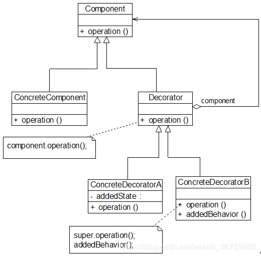

## 装饰模式

### 模式概述

定义：动态地给一个对象增加一些额外的职责。

装饰模式是一种用于替代继承的技术，它通过使用对象之间的关联关系取代类之间的继承关系来给对象动态增加职责。在装饰模式中引入了装饰类，在装饰类中既可以调用待装饰的原有类的方法，还可以增加新的方法，以扩充原有类的功能。

在装饰模式中，我们通常会定义一个抽象装饰类，而将具体的装饰类作为它的子类，装饰模式结构如图所示：


在装饰模式结构图中包含如下几个角色：
* Component（抽象构件）：它是具体构件和抽象装饰类的共同父类，声明抽象业务方法，它的引入可以使客户端以一致的方式处理未被装饰的对象以及装饰之后的对象，实现客户端的透明操作。
* ConcreteComponent（具体构件）：它是抽象构件类的子类，用于定义具体的构件对象，实现在抽象构件中声明的方法，装饰器可以给它增加额外的职责（方法）。
* Decorator（抽象装饰类）：它也是抽象构件类的子类，用于给具体构件增加职责，但是具体职责在其子类中实现。它维护一个指向抽象构件对象的引用，通过该引用可以调用装饰之前构件对象的方法，并通过其子类扩展该方法，以达到装饰的目的。
* ConcreteDecorator（具体装饰类）：它是抽象装饰类的子类，负责向构件添加新的职责。每一个具体装饰类都定义了一些新的行为，它可以调用在抽象装饰类中定义的方法，并可以增加新的方法用以扩充对象的行为。

### 模式实现

由于具体构件类和装饰类都实现了相同的抽象构件接口，因此装饰模式以对客户透明的方式动态地给一个对象附加上更多的责任，换言之，客户端并不会觉得对象在装饰前和装饰后有什么不同。装饰模式可以在不需要创造更多子类的情况下，将对象的功能加以扩展。

定义抽象构件，其典型代码如下所示：
```java
public interface Shape {
    void draw();
}
```

装饰模式的核心在于抽象装饰类的设计，其典型代码如下所示：
```java
public abstract class ShapeDecorator implements Shape {
    protected Shape decoratedShape;

    public ShapeDecorator(Shape decoratedShape) {
        this.decoratedShape = decoratedShape;
    }

    @Override
    public void draw() {
        decoratedShape.draw();
    }
}
```

在抽象装饰类ShapeDecorator中定义一个Shape类型的对象decoratedShape，通过构造方法或Setter方法将一个Shape类型的对象注入，同时由于ShapeDecorator类实现了抽象构件Shape接口，因此需要实现在其中声明的业务方法draw()，需要注意的是在ShapeDecorator中并未真正实现draw()方法，而只是调用decoratedShape对象的draw()方法，它没有真正进行装饰，而是提供一个统一的接口，将具体装饰过程交给子类完成。

在ShapeDecorator的子类即具体装饰类中将重写draw()方法并根据需要进行扩展，典型的具体装饰类代码如下：
```java
public class RedBorderDecorator extends ShapeDecorator {

    public RedBorderDecorator(Shape decoratedShape) {
        super(decoratedShape);
    }

    @Override
    public void draw() {
        decoratedShape.draw();
        setRedBorder();
    }

    private void setRedBorder() {
        System.out.println("Border Color: Red");
    }
}
```

在具体装饰类中调用到抽象装饰类的draw()方法，同时定义新的业务方法，如setRedBorder()。由于在抽象装饰类ShapeDecorator中注入的是Shape类型的对象，因此我们可以将一个具体构件对象注入其中，再通过具体装饰类来进行装饰；此外，我们还可以将一个已经装饰过的ShapeDecorator子类的对象再注入其中进行多次装饰，从而对原有功能的多次扩展。

客户端典型代码如下所示：
```java
public class Client {

    public static void main(String[] args) {

        Shape circle = new Circle();

        Shape redCircle = new RedBorderDecorator(circle);

        Shape redRectangle = new RedBorderDecorator(new Rectangle());
        System.out.println("Circle with normal border");
        circle.draw();

        System.out.println("\nCircle of red border");
        redCircle.draw();

        System.out.println("\nRectangle of red border");
        redRectangle.draw();
    }
}
```

### 延伸

新增一个具体装饰类对具体构件进一步进行装饰，有以下两种方式，分别是通过继承抽象装饰类和继承某个具体装饰类，代码如下所示：
```java
public class RedFillDecorator extends ShapeDecorator {

    public RedFillDecorator(Shape decoratedShape) {
        super(decoratedShape);
    }

    @Override
    public void draw() {
        decoratedShape.draw();
        fill();
    }

    private void fill() {
        System.out.println("Fill Color: Red");
    }
}
```

```java
public class GreenFillDecorator extends RedBorderDecorator {

    public GreenFillDecorator(RedBorderDecorator borderDecorator) {
        super(borderDecorator);
    }

    @Override
    public void draw() {
        decoratedShape.draw();
        fill();
    }

    private void fill() {
        System.out.println("Fill Color: Green");
    }
}
```

对应客户端代码如下所示：
```java
public class Client {

    public static void main(String[] args) {
        Shape circle = new Circle();

        Shape redCircle = new RedBorderDecorator(circle);

        Shape redRectangle = new RedBorderDecorator(new Rectangle());
        
        System.out.println("\nCircle of red border and red padding");
        Shape fillRedCircle = new RedFillDecorator(redCircle);
        fillRedCircle.draw();

        System.out.println("\nRectangle of red border and green padding");
        Shape fillGreenRectangle = new GreenFillDecorator((RedBorderDecorator) redRectangle);
        fillGreenRectangle.draw();
    }
}
```

当然个人推荐继承抽象装饰类的方式符合装饰类模式的初衷。

### 模式总结

装饰模式降低了系统的耦合度，可以动态增加或删除对象的职责，并使得需要装饰的具体构件类和具体装饰类可以独立变化，以便增加新的具体构件类和具体装饰类。

1.主要优点<br/>
(1) 对于扩展一个对象的功能，装饰模式比继承更加灵活性，不会导致类的个数急剧增加。<br/>
(2) 可以通过一种动态的方式来扩展一个对象的功能，通过配置文件可以在运行时选择不同的具体装饰类，从而实现不同的行为。<br/>
(3) 可以对一个对象进行多次装饰，通过使用不同的具体装饰类以及这些装饰类的排列组合，可以创造出很多不同行为的组合。<br/>
(4) 具体构件类与具体装饰类可以独立变化，用户可以根据需要增加新的具体构件类和具体装饰类，原有类库代码无须改变，符合“开闭原则”。

2.主要缺点<br/>
对于多次装饰的对象，调试时寻找错误可能需要逐级排查，较为繁琐。

3.适用场景<br/>
(1) 在不影响其他对象的情况下，以动态、透明的方式给单个对象添加职责。<br/>
(2) 当不能采用继承的方式对系统进行扩展或者采用继承不利于系统扩展和维护时可以使用装饰模式。

### 思考

能否在装饰模式中找出两个独立变化的维度？试比较装饰模式和桥接模式的相同之处和不同之处？

### 参考链接
[装饰模式-Decorator Pattern](https://gof.quanke.name/%E8%A3%85%E9%A5%B0%E6%A8%A1%E5%BC%8F-Decorator%20Pattern.html)