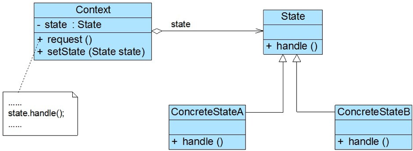

## 状态模式

在软件系统中，有些对象具有多种状态，这些状态在某些情况下能够相互转换，而且对象在不同的状态下也将具有不同的行为。为了更好地对这些具有多种状态的对象进行设计，状态模式应运而生。

### 模式概述

状态模式用于解决系统中复杂对象的状态转换以及不同状态下行为的封装问题。状态模式将一个对象的状态从该对象中分离出来，封装到专门的状态类中，使得对象状态可以灵活变化，对于客户端而言，无须关心对象状态的转换以及对象所处的当前状态，无论对于何种状态的对象，客户端都可以一致处理。

定义：状态模式允许一个对象在其内部状态改变时改变它的行为。

在状态模式中引入了抽象状态类和具体状态类，它们是状态模式的核心，其结构如图所示：<br/>


1. Context（环境类）：环境类又称为上下文类，它是拥有多种状态的对象。由于环境类的状态存在多样性且在不同状态下对象的行为有所不同，因此将状态独立出去形成单独的状态类。在环境类中维护一个抽象状态类State的实例，这个实例定义当前状态，在具体实现时， 它是一个State子类的对象。
2. State（抽象状态类）：它用于定义一个接口以封装与环境类的一个特定状态相关的行为，在抽象状态类中声明了各种不同状态对应的方法，而在其子类中实现类这些方法，由于不同状态下对象的行为可能不同，因此在不同子类中方法的实现可能存在不同，相同的方法可以写在抽象状态类中。
3. ConcreteState（具体状态类）：它是抽象状态类的子类，每一个子类实现一个与环境类的一个状态相关的行为，每一个具体状态类对应环境的一个具体状态，不同的具体状态类其行为有所不同。

### 模式实现

在状态模式中，我们将对象在不同状态下的行为封装到不同的状态类中，为了让系统具有更好的灵活性和可扩展性，同时对各状态下的共有行为进行封装，我们需要对状态进行抽象，即抽象状态类角色，其典型代码如下所示：

```java
public abstract class State {

    /**
     * 声明抽象业务方法，不同的具体状态类可以不同的实现
     */
    public abstract void handle();
}
```

在抽象状态类的子类即具体状态类中实现了在抽象状态类中声明的业务方法，不同的具体状态类可以提供完全不同的方法实现，在实际使用时，在一个状态类中可能包含多个业务方法，如果在具体状态类中某些业务方法的实现完全相同，可以将这些方法移至抽象状态类，实现代码的复用，典型的具体状态类代码如下所示：

```java
public class ConcreteState extends State {

    @Override
    public void handle() {
        // do something
    }
}
```

环境类维持一个对抽象状态类的引用，通过setState()方法可以向环境类注入不同的状态对象，再在环境类的业务方法中调用状态对象的方法，典型代码如下所示：

```java
public class Context {

    /**
     * 维持一个对抽象状态对象的引用
     */
    private State state;

    public void setState(State state) {
        // 设置状态对象
        this.state = state;
    }

    public void request() {
        // 调用状态对象的业务方法
        state.handle();
    }
}
```

环境类实际上是真正拥有状态的对象，我们只是将环境类中与状态有关的代码提取出来封装到专门的状态类中。在状态模式结构图中，环境类Context与抽象状态类State之间存在单向关联关系，在Context中定义了一个State对象。在实际使用时，它们之间可能存在更为复杂的关系，State与Context之间可能也存在依赖或者关联关系。

此外，我们还可以在环境类中添加其它属性变量，然后在业务方法中根据这些属性值进行状态转换。拿开关on/off为例，Context可以修改成如下代码：

```java
public class Context {

    /**
     * 维持一个对抽象状态对象的引用
     */
    private State state;

    /**
     * 其他属性值，该属性值的变化可能会导致对象状态发生变化
     */
    private int value;
    
    public void setState(State state) {
        // 设置状态对象
        this.state = state;
    }

    public void setValue(int value) {
        // 修改属性值
        this.value = value;
        this.changeState();
    }

    public void changeState() {
        if (value == 0) {
            this.setState(new OnState());
        } else if (value == 1){
            this.setState(new OffState());
        }
    }

    public void request() {
        // 调用状态对象的业务方法
        state.handle();
    }
}
```

客户端直接通过setValue()方法设值，可以在方法内部调用changeState()修改状态，再根据handle()方法执行对应的业务方法。

### 模式总结

状态模式将一个对象在不同状态下的不同行为封装在一个个状态类中，通过设置不同的状态对象可以让环境对象拥有不同的行为，而状态转换的细节对于客户端而言是透明的，方便了客户端的使用。

**主要优点**
1. 封装了状态的转换规则，在状态模式中可以将状态的转换代码封装在环境类或者具体状态类中，可以对状态转换代码进行集中管理，而不是分散在一个个业务方法中。
2. 允许状态转换逻辑与状态对象合成一体，而不是提供一个巨大的条件语句块，状态模式可以让我们避免使用庞大的条件语句来将业务方法和状态转换代码交织在一起。

**主要缺点**
1. 状态模式的使用会增加系统中类和对象的个数，导致系统运行开销增大。
2. 状态模式对“开闭原则”的支持并不太好，增加新的状态类需要修改那些负责状态转换的源代码，否则无法转换到新增状态；而且修改某个状态类的行为也需修改对应类的源代码。

**适用场景**
1. 对象的行为依赖于它的状态（如某些属性值），状态的改变将导致行为的变化。
2. 在代码中包含大量与对象状态有关的条件语句，这些条件语句的出现，会导致代码的可维护性和灵活性变差，不能方便地增加和删除状态，并且导致客户类与类库之间的耦合增强。

### 参考链接

[状态模式-State Pattern](https://gof.quanke.name/%E7%8A%B6%E6%80%81%E6%A8%A1%E5%BC%8F-State%20Pattern.html)

