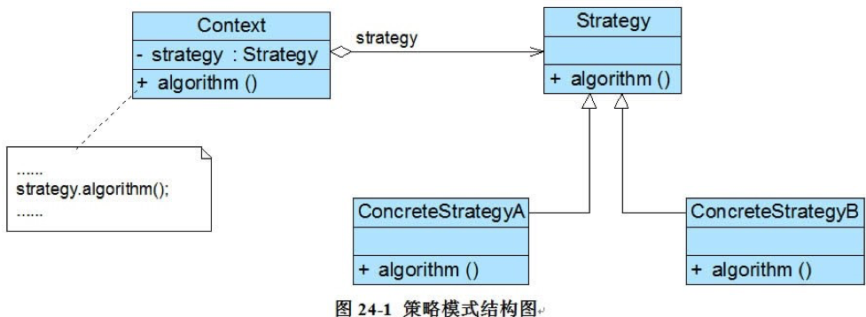

## 策略模式

参考链接：[策略模式-Strategy Pattern](https://gof.quanke.name/%E7%AD%96%E7%95%A5%E6%A8%A1%E5%BC%8F-Strategy%20Pattern.html)

由于策略模式相比其他行为模式使用更加频繁，所以我决定将它提上来讲。

在软件开发中，我们也常常遇到以下的情况，实现某一个功能有多条途径，每一条途径对应一种算法，此时我们可以使用一种设计模式来实现灵活地选择解决途径，也能够方便地增加新的解决途径。策略模式的产生就是为了适应算法灵活性。

### 模式概述

定义：定义一系列算法类，将每一个算法封装起来，并让它们可以相互替换，策略模式让算法独立于使用它的客户而变化。

策略模式结构并不复杂，但我们需要理解其中环境类Context的作用，其结构如图所示：<br/>


* Context（环境类）：环境类是使用算法的角色，它在解决某个问题（即实现某个方法）时可以采用多种策略。在环境类中维持一个对抽象策略类的引用实例，用于定义所采用的策略。
* Strategy（抽象策略类）：它为所支持的算法声明抽象方法，是所有策略类的父类，它可以是抽象类或具体类，也可以是接口。环境类通过抽象策略类中声明的方法在运行时调用具体策略类中实现的算法。
* ConcreteStrategy（具体策略类）：它实现在抽象策略类中声明的算法。在运行时，具体策略类将覆盖在环境类中定义的抽象策略类对象，使用一种具体的算法实现某个业务处理。

### 模式实现

在使用策略模式时，我们需要将算法从Context类中提取出来，首先应该创建一个抽象策略类，其典型代码如下所示：

```java
public abstract class AbstractStrategy {

    /**
     * 声明抽象算法
     */
    public abstract void algorithm();
}
```

然后再将封装每一种具体算法的类作为该抽象策略类的子类，如下代码所示：

```java
public class ConcreteStrategyA extends AbstractStrategy {

    @Override
    public void algorithm() {
        System.out.println("ConcreteStrategyA");
    }
}

public class ConcreteStrategyB extends AbstractStrategy {

    @Override
    public void algorithm() {
        System.out.println("ConcreteStrategyB");
    }
}
```

其他具体策略类与之类似，对于Context类而言，在它与抽象策略类之间建立一个关联关系，其典型代码如下所示：

```java
public class Context {

    /**
     * 维持一个对抽象策略类的引用
     */
    private AbstractStrategy strategy;

    public void setStrategy(AbstractStrategy strategy) {
        this.strategy = strategy;
    }

    /**
     * 调用策略类中的算法
     */
    public void algorithm() {
        strategy.algorithm();
    }
}
```

在Context类中定义一个AbstractStrategy类型的对象strategy，通过注入的方式在客户端传入一个具体策略对象，客户端代码片段如下所示：

```java
public class Client {

    public static void main(String[] args) {
        Context context = new Context();
        //可在运行时指定类型
        AbstractStrategy strategy = new ConcreteStrategyA();
        context.setStrategy(strategy);
        context.algorithm();
    }
}
```

在客户端代码中只需注入一个具体策略对象，可以将具体策略类类名存储在配置文件中，通过反射来动态创建具体策略对象，从而使得用户可以灵活地更换具体策略类，增加新的具体策略类也很方便。策略模式提供了一种可插入式(Pluggable)算法的实现方案。

### 模式总结

策略模式用于算法的自由切换和扩展，它是应用较为广泛的设计模式之一。策略模式对应于解决某一问题的一个算法族，允许用户从该算法族中任选一个算法来解决某一问题，同时可以方便地更换算法或者增加新的算法。只要涉及到算法的封装、复用和切换都可以考虑使用策略模式。

1. 主要优点<br/>
(1) 策略模式提供了对“开闭原则”的完美支持，用户可以在不修改原有系统的基础上选择算法或行为，也可以灵活地增加新的算法或行为。<br/>
(2) 使用策略模式可以避免多重条件选择语句。多重条件选择语句不易维护，它把采取哪一种算法或行为的逻辑与算法或行为本身的实现逻辑混合在一起，将它们全部硬编码(Hard Coding)在一个庞大的多重条件选择语句中，比直接继承环境类的办法还要原始和落后。<br/>
(3) 策略模式提供了一种算法的复用机制，由于将算法单独提取出来封装在策略类中，因此不同的环境类可以方便地复用这些策略类。

2. 主要缺点<br/>
(1) 策略模式将造成系统产生很多具体策略类，任何细小的变化都将导致系统要增加一个新的具体策略类。<br/>
(2) 无法同时在客户端使用多个策略类，也就是说，在使用策略模式时，客户端每次只能使用一个策略类，不支持使用一个策略类完成部分功能后再使用另一个策略类来完成剩余功能的情况。

3. 适用场景<br/>
(1) 一个系统需要动态地在几种算法中选择一种，那么可以将这些算法封装到一个个的具体算法类中，而这些具体算法类都是一个抽象算法类的子类。<br/>
(2) 一个对象有很多的行为，如果不用恰当的模式，这些行为就只好使用多重条件选择语句来实现。

### 思考

一个环境类Context能否对应多个不同的策略等级结构？如何设计？

### 参考链接

[策略模式-Strategy Pattern](https://gof.quanke.name/%E7%AD%96%E7%95%A5%E6%A8%A1%E5%BC%8F-Strategy%20Pattern.html)
