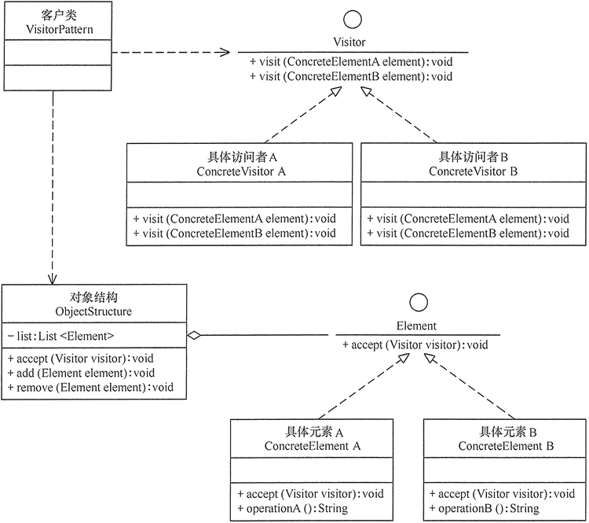

## 访问者模式

### 模式概述

在现实生活中，有些集合对象中存在多种不同的元素，且每种元素也存在多种不同的访问者和处理方式。例如，医生开具的处方单（药单）上包含多种药品，査看它的划价人员和药房工作人员对它的处理方式也不同，划价人员根据处方单上的药品名称和数量计算总价，药房工作人员根据药品名称和数量准备药品。

在软件开发中，有时候我们也需要处理像处方单这样的集合对象结构，在该对象结构中存储了多个不同类型的对象信息，而且对同一对象结构中的元素的操作方式并不唯一，可能需要提供多种不同的处理方式，还有可能增加新的处理方式。在设计模式中，有一种模式可以满足上述要求，其模式动机就是以不同的方式操作复杂对象结构，该模式就是我们本章将要介绍的访问者模式。

先来看下访问者模式的定义：它是一种将作用于某种数据结构中的各元素的操作分离出来封装成独立的类，使其在不改变数据结构的前提下可以添加作用于这些元素的新的操作，为数据结构中的每个元素提供多种访问方式。它将对数据的操作与数据结构进行分离，是行为型模式中最复杂的一种模式。

访问者模式包含访问者和被访问元素两个主要组成部分，这些被访问的元素通常具有不同的类型，且不同的访问者可以对它们进行不同的访问操作。例如处方单中的各种药品信息就是被访问的元素，而划价人员和药房工作人员就是访问者。访问者模式使得用户可以在不修改现有系统的情况下扩展系统的功能，为这些不同类型的元素增加新的操作。

访问者模式的结构较为复杂，其结构如图所示：<br>


1. Visitor（抽象访问者）：抽象访问者为对象结构中每一个具体元素类ConcreteElement声明一个访问操作，从这个操作的名称或参数类型可以清楚知道需要访问的具体元素的类型，具体访问者需要实现这些操作方法，定义对这些元素的访问操作。
2. ConcreteVisitor（具体访问者）：具体访问者实现了每个由抽象访问者声明的操作，每一个操作用于访问对象结构中一种类型的元素。
3. Element（抽象元素）：抽象元素一般是抽象类或者接口，它定义一个accept()方法，该方法通常以一个抽象访问者作为参数。
4. ConcreteElement（具体元素）：具体元素实现了accept()方法，在accept()方法中调用访问者的访问方法以便完成对一个元素的操作。
5. ObjectStructure（对象结构）：对象结构是一个元素的集合，它用于存放元素对象，并且提供了遍历其内部元素的方法。它可以结合组合模式来实现，也可以是一个简单的集合对象，如一个List对象或一个Set对象。

### 模式实现

在访问者模式中，抽象访问者定义了访问元素对象的方法，通常为每一种类型的元素对象都提供一个访问方法，而具体访问者可以实现这些访问方法。当然，如果所有的访问者对某一类型的元素的访问操作都相同，则可以将操作代码移到抽象访问者类中，典型代码如下：

```java
public interface Visitor {
    void visit(ConcreteElementA element);
    void visit(ConcreteElementB element);
}
```

抽象访问者中重载visit()方法的方式来定义多个方法用于操作不同类型的元素对象。在抽象访问者Visitor类的子类ConcreteVisitor中实现了抽象的访问方法，用于定义对不同类型元素对象的操作。定义两个具体访问者实现抽象访问者，代码如下：

```java
public class ConcreteVisitorA implements Visitor {

    @Override
    public void visit(ConcreteElementA element) {
        System.out.println(element.operation());
    }

    @Override
    public void visit(ConcreteElementB element) {
        System.out.println(element.operation());
    }
}

public class ConcreteVisitorB implements Visitor {

    @Override
    public void visit(ConcreteElementA element) {
        System.out.println(element.operation());
    }

    @Override
    public void visit(ConcreteElementB element) {
        System.out.println(element.operation());
    }
}
```

对于元素类而言，在其中一般都定义了一个accept()方法，用于接受访问者的访问，并传入一个抽象访问者Visitor类型的参数，在程序运行时再确定具体访问者的类型，代码如下：

```java
public interface Element {
    void accept(Visitor visitor);
}
```

在具体元素类ConcreteElementA的accept()方法中，通过调用Visitor类的visit()方法实现对元素的访问，并以当前对象作为visit()方法的参数，代码如下：

```
public class ConcreteElementA implements Element {

    @Override
    public void accept(Visitor visitor) {
        visitor.visit(this);
    }

    public String operation() {
        return "DO A.";
    }
}

public class ConcreteElementB implements Element {

    @Override
    public void accept(Visitor visitor) {
        visitor.visit(this);
    }

    public String operation() {
        return "Do B.";
    }
}
```

最后是对象结构，它用于存储元素对象并接受访问者的访问，其典型代码如下所示：

```java
public class ObjectStructure {

    // 存放元素对象
    private List<Element> list = new ArrayList<>();

    public void accept(Visitor visitor) {
        for (Element element : list) {
            element.accept(visitor);
        }
    }

    public void add(Element element) {
        list.add(element);
    }

    public void remove(Element element) {
        list.remove(element);
    }
}
```

在对象结构中遍历集合中的元素对象，并逐个调用每一个对象的accept()方法，实现对元素对象的访问操作。

### 模式总结

当系统中存在一个较为复杂的对象结构，且不同访问者对其所采取的操作也不相同时，可以考虑使用访问者模式进行设计。

**主要优点**

1. 增加新的访问操作只要增加一个新的具体访问者类，实现简单，无须修改源代码，符合“开闭原则”。
2. 将有关元素对象的访问行为集中到一个访问者对象中，而不是分散在一个个的元素类中。类的职责更加清晰，有利于对象结构中元素对象的复用，相同的对象结构可以供多个不同的访问者访问。

**主要缺点**

1. 增加新的元素类很困难，每增加一个新的元素类都意味着要在抽象访问者角色中增加一个新的抽象操作，并在每一个具体访问者类中增加相应的具体操作，这违背了“开闭原则”的要求。
2. 破坏封装，访问者模式要求访问者对象访问并调用每一个元素对象的操作，这意味着元素对象有时候必须暴露一些自己的内部操作和内部状态，否则无法供访问者访问。

**适用场景**

1. 一个对象结构包含多个类型的对象，希望对这些对象实施一些依赖其具体类型的操作。在访问者中针对每一种具体的类型都提供了一个访问操作，不同类型的对象可以有不同的访问操作。
2. 需要对一个对象结构中的对象进行很多不同的并且不相关的操作，而需要避免让这些操作直接添加到这些对象的类中，也不希望在增加新操作时修改这些类。访问者模式使得我们可以将相关的访问操作集中起来定义在访问者类中，对象结构可以被多个不同的访问者类所使用，将对象本身与对象的访问操作分离。
3. 对象结构中对象对应的类很少改变，但经常需要在此对象结构上定义新的操作（因为增加新的元素类会违背“开闭原则”）。

### 我的思考

访问者模式是否符合“开闭原则”？【从增加新的访问者和增加新的元素两方面考虑。】

答案已给出。


